# 任务10 交付：工具清单与 Mermaid 流程图

## 一、交付范围

根据现场执行总览，任务10中适合交给 Codex 快速完成的部分是：

1. 标准 Mermaid 流程图代码
2. 工具清单表格
3. 每个环节的输入、AI处理、输出、频率、人工复核点

这些内容可直接粘贴进 `任务10_绿电微网全链路AI业务协同工作流.md` 的“全链路 AI 工作流设计”和“工具搭配清单”部分。

## 二、标准 Mermaid 流程图

```mermaid
flowchart LR
  subgraph S1[获客]
    A1[招投标公告采集<br>南网/政府采购/行业平台] --> A2[AI清洗去重<br>统一字段+去重]
    A2 --> A3[AI标签分类<br>直流微网/储能/光伏/充电桩/数据中心]
    A3 --> A4[线索评分排序<br>高/中/低优先级]
  end

  subgraph S2[分析]
    A4 --> B1[招标需求解析<br>提取技术要求和商务约束]
    B1 --> B2[能力匹配<br>匹配公司产品/案例/参数]
    B2 --> B3[投标亮点生成<br>差异化优势+响应策略]
  end

  subgraph S3[售前与交付]
    B3 --> C1[售前智能体问答<br>客户问题+方案推荐]
    C1 --> C2[方案书与素材生成<br>文档/PPT/架构图/界面示意]
    C2 --> C3[项目交付资料沉淀<br>配置/清单/验收/问题记录]
  end

  subgraph S4[运维]
    C3 --> D1[场站运行数据采集<br>设备/能耗/光伏/储能/充电桩]
    D1 --> D2[AI运营分析<br>能耗/绿电消纳/异常/碳资产]
    D2 --> D3[运营报告输出<br>日报/周报/月报/管理看板]
  end

  subgraph S5[数据资产回流]
    D3 --> E1[知识库更新<br>案例/参数/FAQ/交付经验]
    E1 --> E2[标签体系优化<br>项目类型/客户画像/方案模板]
    E2 --> B2
    E2 --> C1
  end
```

## 三、工具清单表格

| 环节 | 推荐工具 | 输入 | AI处理 | 输出 | 频率 | 人工复核点 |
| --- | --- | --- | --- | --- | --- | --- |
| 招投标线索采集 | Python爬虫、Dify、Coze、低代码采集工具 | 南网采购平台、政府采购、行业招标公告 | 抓取近7天公告，提取标题、采购单位、发布时间、链接、正文摘要 | 原始公告数据表 | 每日1-2次 | 确认抓取来源合规，不绕过登录和反爬规则 |
| 数据清洗与分类 | Python、Excel、AI编程工具 | 原始公告数据表 | 去重、统一字段、关键词匹配、标签分类 | 标准化线索表 | 每次采集后 | 检查误分类和重复项目 |
| 线索评分 | Python规则引擎、LLM分类模型 | 标准化线索表、公司业务关键词 | 按直流微网、储能、光伏、充电桩、数据中心供电等标签评分 | 高/中/低优先级线索清单 | 每日 | 销售确认是否进入跟进池 |
| 投标亮点生成 | ChatGPT、Claude、通义、文心、Kimi | 招标文件、公司产品资料、历史案例 | 提取客户需求，匹配公司能力，生成3-5条投标亮点 | 投标亮点初稿 | 每个确认线索触发 | 售前校验技术参数和承诺边界 |
| 初步方案生成 | LLM + 公司知识库RAG | 招标需求、产品参数、场景模板 | 生成技术方案框架、系统架构、实施路径 | 方案初稿/Markdown/PPT大纲 | 每个项目触发 | 技术负责人确认可行性 |
| 售前智能体 | Dify、Coze、扣子、企业知识库 | 产品手册、FAQ、方案库、客户问题 | 意图识别、知识库检索、场景化回答 | 售前问答、方案推荐 | 7x24或工作时段 | 超出知识库范围时转人工 |
| 宣传素材与界面生成 | Figma、即时设计、Canva、AI图片工具 | 方案文档、品牌规范、项目场景 | 生成配图提示词、界面示意、宣传文案 | 投标配图、方案图、宣传海报 | 随项目触发 | 设计师检查品牌一致性和专业度 |
| 项目交付资料沉淀 | Notion、飞书文档、企业知识库、网盘 | 项目配置、设备清单、验收材料、问题记录 | 结构化归档、抽取可复用模板 | 交付知识库、案例库 | 项目节点更新 | 项目经理确认资料完整性 |
| 运维数据分析 | BI、Excel、Python、绿电运营平台 | 电表、光伏、储能、充电桩、告警日志 | 能耗统计、异常检测、绿电消纳分析、碳资产计算 | 运营报告、管理看板、异常清单 | 日/周/月 | 运维人员确认异常原因 |
| 数据资产回流 | 向量数据库、知识库、CRM、数据中台 | 线索结果、方案、交付、运维报告 | 更新标签、案例、FAQ、客户画像、方案模板 | 可复用数据资产 | 每周/月复盘 | 产品经理审核知识是否过期 |

## 四、每个环节的输入输出闭环

| 阶段 | 输入 | AI输出 | 业务动作 | 回流数据 |
| --- | --- | --- | --- | --- |
| 获客 | 招投标公告、政策公告、行业新闻 | 高价值项目线索、标签、优先级 | 销售判断是否跟进 | 跟进结果、客户画像 |
| 分析 | 招标文件、客户需求、公司产品资料 | 投标亮点、方案框架、风险提示 | 售前完善方案 | 方案模板、常见问题 |
| 交付 | 中标方案、项目配置、设备清单 | 交付清单、验收要点、项目知识卡片 | 项目经理执行交付 | 交付经验、问题记录 |
| 运维 | 场站数据、能耗数据、碳排数据 | 能耗报告、异常分析、碳资产报告 | 运维优化和客户汇报 | 运维案例、节能策略 |
| 资产化 | 全链路沉淀数据 | 知识库、标签库、模板库、模型样本 | 产品迭代和商业化包装 | 标准化解决方案 |

## 五、可直接用于现场汇报的话术

这套工作流不是简单把 AI 工具串起来，而是让每个业务动作都形成数据回流：招投标线索进入客户画像，售前方案进入知识库，交付经验进入案例库，运维数据进入绿电消纳和碳资产模型。这样公司后续不仅能提升内部效率，还能把数据沉淀成平台服务、运维服务和行业解决方案能力。

