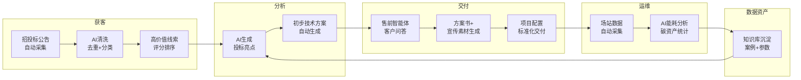

# 绿电微网公司全链路 AI 业务协同工作流

## 一、业务背景与痛点

深圳市绿电微网新技术有限公司主营绿电直流微网解决方案，业务覆盖「获客→售前→交付→运维」全链路。当前痛点：

| 环节 | 痛点 | 影响 |
| --- | --- | --- |
| 获客 | 新能源招投标信息分散在10+平台，人工筛选每天耗时2h+ | 高价值项目漏掉、响应滞后 |
| 售前 | 技术方案/投标亮点重复劳动，口径不统一 | 响应慢、方案质量参差 |
| 交付 | 项目参数、配置、验收标准散落各人手中 | 交付标准不一，返工多 |
| 运维 | 场站运行数据、能耗、碳资产人工统计 | 数据滞后30天，无法实时决策 |
| 数据沉淀 | 项目经验没有形成可复用知识库 | 新项目从零开始，无法复利 |

---

## 二、全链路 AI 工作流设计

### 整体流程图



### 各环节详细设计

---

### 环节1：AI 爬取筛选新能源招标线索

| 项目 | 内容 |
| --- | --- |
| **输入** | 中国招标投标公共服务平台、各省电子招投标平台、中国政府采购网等10+来源 |
| **AI处理** | 定时爬取→关键词匹配(光伏/储能/充电站/直流微网/绿电)→去重→分类→价值评分 |
| **输出** | 每日推送高价值线索清单(含项目名称、预算、截止时间、匹配度评分) |
| **人工复核** | 销售确认是否跟进，标记跟进状态 |
| **工具** | Python爬虫(Scrapy/Requests) + Claude API文本分类 + 飞书/企微推送 |
| **频率** | 每日2次(8:00/14:00) |
| **提效** | 人工2h/天 → 5min/天确认，节约90%筛选时间 |

---

### 环节2：AI 生成项目投标亮点与初步方案

| 项目 | 内容 |
| --- | --- |
| **输入** | 线索详情 + 公司产品库 + 历史中标案例 + 技术参数库 |
| **AI处理** | 分析招标需求关键词→匹配公司能力→生成投标亮点3-5条→生成技术方案框架 |
| **输出** | 结构化投标亮点文档 + 技术方案初稿(含系统架构、关键指标、交付方案) |
| **人工复核** | 售前工程师校验技术参数准确性、调整方案侧重点 |
| **工具** | Claude API(长文本理解+生成) + 公司知识库RAG检索 + Markdown模板 |
| **频率** | 每个线索确认跟进后触发 |
| **提效** | 方案初稿从3天→30分钟，人工只需校验修改 |

---

### 环节3：AI 智能体解答客户售前咨询

| 项目 | 内容 |
| --- | --- |
| **输入** | 客户问题(文字/语音) + 公司知识库(产品手册/技术白皮书/FAQ/历史项目) |
| **AI处理** | 意图识别→知识库检索→生成专业回答→不确定问题转人工 |
| **输出** | 即时回复客户(技术参数、方案对比、案例推荐、报价参考) |
| **人工复核** | 超出知识库范围或涉及报价承诺时，自动转人工售前 |
| **工具** | Dify/Coze搭建智能体 + 公司知识库向量化 + 企微/飞书集成 |
| **频率** | 7×24实时响应 |
| **提效** | 80%常见问题秒回，售前人力释放60%用于高价值客户 |

---

### 环节4：AI 设计项目宣传素材与界面

| 项目 | 内容 |
| --- | --- |
| **输入** | 项目方案文档 + 品牌规范 + 场景需求(投标PPT/产品手册/展厅大屏) |
| **AI处理** | 文档摘要→生成配图提示词→AI出图→排版套模板 |
| **输出** | 方案配图、系统界面示意、架构图、宣传海报 |
| **人工复核** | 设计师审核品牌一致性和视觉质量 |
| **工具** | GPT-Image/MidJourney(配图) + Canva/即时设计(排版) + Claude(文案) |
| **频率** | 随项目需求触发 |
| **提效** | 素材制作从2天→2小时 |

---

### 环节5：AI 处理项目数据统计分析

| 项目 | 内容 |
| --- | --- |
| **输入** | 场站SCADA实时数据 + 电量计量 + 碳排放因子 |
| **AI处理** | 数据清洗→能耗统计→碳减排计算→异常检测→趋势预测→报告生成 |
| **输出** | 日/周/月运营报告(能耗、绿电消纳率、碳资产、告警) |
| **人工复核** | 运维确认异常告警、管理层审阅月报 |
| **工具** | Python数据处理 + AI异常检测 + 自动化报告(Markdown/PDF) + 运营看板 |
| **频率** | 日报自动生成，异常实时告警 |
| **提效** | 月报从人工3天→自动生成，异常发现从事后→实时 |

---

## 三、工具搭配清单

| 环节 | AI工具 | 非AI工具 | 协同方式 |
| --- | --- | --- | --- |
| 线索采集 | Claude API(分类评分) | Python Scrapy(爬取)、飞书(推送) | 爬虫定时跑→AI打分→推送通知 |
| 方案生成 | Claude API(RAG+生成) | Markdown模板、知识库 | 知识库检索→AI组装→人工校验 |
| 售前问答 | Dify智能体(RAG+对话) | 企微/飞书(触达)、知识库 | 客户提问→智能体回答→超限转人工 |
| 素材设计 | GPT-Image(配图)、Claude(文案) | Canva/即时设计(排版) | AI出图出文案→设计工具排版 |
| 数据统计 | Claude API(异常检测+报告) | Python pandas(计算)、看板 | 数据清洗→AI分析→自动报告 |
| 知识沉淀 | Claude API(摘要+标签) | 向量数据库、文档管理 | 项目完结→AI提炼→入库→供全链路复用 |

**共整合6类AI工具能力：** 文本分类、长文生成、RAG问答、图像生成、数据分析、知识摘要

---

## 四、数据资产闭环

```
招投标数据 ──┐
客户咨询记录 ──┤
项目交付参数 ──┼──▶ 知识库(向量化) ──▶ 供全链路AI调用
运维运行数据 ──┤
中标/丢标复盘 ──┘
```

**闭环逻辑：**

1. 每个项目的交付参数、客户反馈、运行数据在结项时自动入库
2. 新线索评分时调用历史数据（"我们做过类似项目，成功率高"）
3. 方案生成时引用最近案例（"类似园区我们实现了消纳率85%"）
4. 智能体回答时基于真实数据（"我们某数据中心项目PUE优化了12%"）
5. 数据越多→AI越准→赢率越高→数据更多，形成飞轮

---

## 五、落地节奏建议

| 阶段 | 周期 | 目标 | 交付物 |
| --- | --- | --- | --- |
| Phase 1 | 2周 | 线索采集+方案生成跑通 | 爬虫脚本+AI评分+方案模板 |
| Phase 2 | 3周 | 售前智能体上线 | Dify智能体+知识库+企微接入 |
| Phase 3 | 4周 | 数据统计自动化 | 运营看板+自动报告+告警 |
| Phase 4 | 持续 | 知识库沉淀+全链路闭环 | 数据资产体系+复利循环 |

---

## 六、风险与控制措施

| 风险 | 影响 | 控制措施 |
| --- | --- | --- |
| 招标平台反爬 | 数据断供 | 多源冗余+API优先+人工兜底 |
| AI幻觉(方案参数错误) | 投标风险 | 关键数值必须人工复核+知识库溯源 |
| 知识库数据过时 | 回答不准 | 设置数据有效期+定期清洗+版本标记 |
| 客户数据隐私 | 合规风险 | 项目数据脱敏后入库+访问权限控制 |
| 投标文件AI痕迹 | 专业度质疑 | 最终文件必须人工润色+格式统一 |

---

## 七、业务提效价值总结

| 角色 | 提效点 | 量化收益 |
| --- | --- | --- |
| 销售 | 线索筛选自动化 | 节约90%筛选时间(2h→5min/天) |
| 售前 | 方案初稿自动生成 | 交付周期从3天→30分钟 |
| 客服 | 智能体7×24接待 | 80%问题秒回，人力释放60% |
| 设计 | AI配图+模板排版 | 素材制作从2天→2小时 |
| 运维 | 自动报告+实时告警 | 异常发现从事后→实时 |
| 管理层 | 全链路数据可视 | 从碎片信息→统一决策视图 |

**全链路综合提效：业务响应速度提升5-10倍，人力成本降低40-60%，数据资产从零到可复利。**

---

## 八、设计思路与业务落地说明

### 设计思路

本工作流不是"AI工具堆砌"，而是基于绿电微网公司真实业务链路设计：

1. **以业务环节为骨架**：获客→分析→交付→运维，每个环节有明确的输入/输出/人工复核点
2. **AI能力精准匹配**：不同环节用不同AI能力（分类、生成、RAG、图像、分析），而非一个万能模型
3. **数据闭环驱动复利**：每个环节产出的数据回流知识库，下一次调用时AI更准，形成飞轮
4. **人机协同不是全替代**：AI做80%标准化工作，人工把关20%关键决策（报价、技术承诺、客户承诺）

### 落地关键

- **最小可行路径**：先从"线索采集+方案生成"开始，2周内能看到效果
- **知识库是核心资产**：工具可以换，数据不能丢——所有AI产出和项目数据必须沉淀
- **渐进式信任**：初期AI建议+人工确认，数据积累后逐步放开自动化程度
