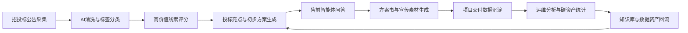

# 任务10：全链路 AI 业务协同工作流搭建

## 一句话定位

围绕绿电微网公司的获客、分析、售前、交付、运维，搭建一套可落地的 AI 办公与业务协同工作流。

## 成果文件名

`任务10_绿电微网全链路AI业务协同工作流.md`

## 推荐流程图结构

## 工具搭配清单

| 环节 | 工具 | 作用 |
| --- | --- | --- |
| 线索采集 | Dify/Coze/低代码爬虫/Python | 抓取招投标公告 |
| 数据清洗 | Python/Excel/AI编程工具 | 去重、分类、标签、优先级 |
| 方案生成 | ChatGPT/Claude/国产大模型 | 生成投标亮点和初步方案 |
| 智能体 | Dify/Coze/扣子/企业知识库 | 售前问答、方案推荐 |
| 设计表达 | Figma/即时设计/Canva/AI作图 | 界面、宣传图、投标配图 |
| 运营分析 | BI/Excel/轻量看板 | 项目数据、能耗、碳资产统计 |

## 输出结构

### 1. 业务痛点

- 招投标信息分散，人工筛选成本高
- 售前方案重复劳动多，响应速度慢
- 技术参数和案例资料分散，容易口径不一致
- 项目交付和运维数据没有沉淀成资产

### 2. 全链路流程

1. AI 爬取和筛选新能源招标线索
2. AI 自动打标签和线索优先级评分
3. AI 生成项目投标亮点和初步方案
4. 行业智能体回答客户售前咨询
5. AI 辅助生成宣传素材、界面和方案图
6. AI 处理项目能耗、绿电、碳资产数据
7. 数据回流知识库，形成公司数据资产

### 3. 业务提效价值

- 销售：更快发现高价值项目
- 售前：更快生成方案初稿和投标亮点
- 产品：从项目数据中反推功能迭代
- 运维：更快发现异常和节能机会
- 管理层：看到线索、项目、收益、碳资产的统一视图

### 4. 风险控制

- 外部公告抓取需遵守平台规则
- 客户项目数据入库前需脱敏
- 智能体回答必须绑定公司知识库
- 投标文件和技术承诺必须人工复核

## 成功标志

- 能讲清楚每一步输入、AI处理、输出、人工复核点
- 工具不是堆砌，而是形成业务闭环
- 能体现数据资产回流

