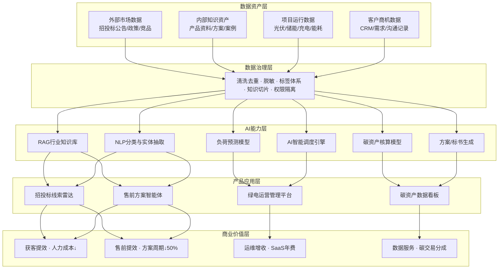

# 任务11：绿电微网 AI 产品架构与数据资产增值规划

## 核心逻辑

绿电微网现有业务中，数据是未被计入的"隐性资产"。本规划的核心逻辑：

> **盘清存量数据资产 → 定义AI产品矩阵释放价值 → 形成"项目交付→数据沉淀→AI增值→反哺获客"的飞轮**

不是"用AI做个工具"，而是把数据变成公司第二增长曲线的基础设施。

---

## 一、公司数据资产盘点与成熟度评估

### 盘点原则

不只看"有什么数据"，更要评估"这些数据离产生商业价值还差几步"。

| 数据类型 | 来源 | 当前状态 | 可用度 | 增值潜力 | 治理优先级 |
|---|---|---|---|---|---|
| 招投标数据 | 南方电网、政府采购、各省电力交易平台 | 散落各平台，人工搜索+Excel汇总 | ★★☆ 半结构化 | 高：直接缩短获客链路 | **P0** |
| 产品技术资料 | 设备参数手册、方案书、白皮书、技术标 | 有积累但未结构化，存在个人电脑或网盘 | ★★☆ 文档态 | 中高：可做售前知识库 | P1 |
| 客户需求数据 | CRM记录、售前沟通纪要、调研表、需求书 | 非结构化，分散在聊天记录和邮件中 | ★☆☆ 非结构化 | 中：客户画像+需求预判 | P2 |
| 项目运行数据 | 光伏逆变器、储能BMS、直流母线、充电桩 | 设备端有采集，但未统一入湖 | ★★★ 结构化 | **极高：可量化产生收入** | P1 |
| 运维能耗数据 | 电表、平台日志、气象数据、负荷曲线 | 实时流式，部分项目已有历史积累 | ★★★ 结构化 | 极高：碳资产核算+AI调度 | P1 |

### 优先级排序逻辑

**排序公式：投入产出比 × 数据就绪度 × 业务紧迫度**

- **P0 选招投标数据**：数据公开可采、治理成本最低、销售团队每天都在痛（手动翻平台找标，效率极低），是"离钱最近"的数据
- **P1 运行数据和技术资料并行**：运行数据价值最高但需要IoT基建到位后才能发力；技术资料只需文档切片即可接入RAG
- **P2 客户需求数据延后**：依赖CRM规范化使用，短期ROI不明确

---

## 二、AI 产品架构

### 架构总览



### AI 产品矩阵与盈利模式

| AI产品 | 服务对象 | 核心AI能力 | 盈利模式 | 年化预估价值 |
|---|---|---|---|---|
| 招投标线索雷达 | 内部销售团队 | NLP关键词匹配+项目分类+去重 | 获客效率提升→间接增收 | 节省1-2人力 ≈ 20-40万/年 |
| 售前方案智能体 | 售前工程师 | RAG知识库+方案模板生成 | 方案周期缩短50%→承接更多项目 | 人效提升 ≈ 30万/年 |
| 绿电运营管理平台 | 甲方运维+本司运维 | AI调度+负荷预测+能耗优化 | **SaaS年费 / 运维服务费** | 5-15万/站/年 |
| 碳资产数据看板 | 甲方决策层+碳管理部门 | 碳核算+CCER估值+报告生成 | **数据服务费 + 碳交易分成** | 视碳价与项目规模 |
| 投标方案生成助手 | 投标团队 | RAG+结构化模板+合规校验 | 内部效率工具（降本） | 节省外包费 ≈ 10-20万/年 |

**关键判断：** 前两个产品是"降本型"（省人省时间），后两个是"增收型"（直接产生收入）。公司应先用降本型产品快速验证AI能力，再推增收型产品拓展商业模式。

---

## 三、数据资产增值路径

### 五级增值模型

```
Level 1 → Level 2 → Level 3 → Level 4 → Level 5
数据可见    数据可用    数据可问    数据可算    数据可卖
```

| 层级 | 定义 | 对应动作 | 商业价值 |
|---|---|---|---|
| L1 数据可见 | 知道有哪些数据、在哪里 | 数据资产盘点、统一归档 | 管理基础，无直接收入 |
| L2 数据可用 | 数据已清洗、标签化、可检索 | ETL流水线、标签体系、权限管理 | 内部效率提升 |
| L3 数据可问 | 接入知识库，员工可自然语言查询 | RAG知识库+智能体部署 | 售前/销售效率翻倍 |
| L4 数据可算 | 用于预测、调度、收益测算 | AI模型训练+调度引擎 | 运维增值服务开始收费 |
| L5 数据可卖 | 形成外部付费产品 | 平台SaaS化+数据报告产品化 | **第二增长曲线** |

### 飞轮效应

```
新项目交付 → 设备接入 → 运行数据沉淀
                                ↓
              AI调度模型训练（数据越多越准）
                                ↓
              运营平台价值↑ → 客户续费+转介绍
                                ↓
              更多项目 → 更多数据 → 飞轮加速
```

**一句话：** 前3个项目靠技术方案打动客户，第4个项目开始靠数据服务续费，第10个项目开始我们的AI调度比竞对准30%——这就是数据资产的复利效应。

---

## 四、分阶段路线图

| 阶段 | 时间 | 核心目标 | 关键交付物 | 决策依据 |
|---|---|---|---|---|
| **MVP** | 1-2个月 | 招投标线索自动分类 + 售前知识库智能体 | 线索雷达原型、知识库问答demo | 数据已有、治理成本低、业务最痛 |
| **V1** | 3-6个月 | 接入前3个项目运行数据，形成运营看板+方案生成 | 运营管理平台V1、方案生成助手 | 需要等项目交付后积累运行数据 |
| **V2** | 6-12个月 | 建立AI调度能力、绿电消纳分析、碳资产量化 | AI调度引擎、碳资产看板 | 需要6个月+运行数据训练模型、碳市场政策渐明朗 |
| **V3** | 12个月+ | 平台对外输出，形成行业数据服务商业模式 | SaaS开放平台、行业数据报告产品 | 需要10+项目数据积累形成竞争壁垒 |

### 各阶段投入估算

| 阶段 | 人力投入 | 技术成本 | 预期产出 |
|---|---|---|---|
| MVP | 产品1人+开发1人，兼职3个月 | API调用费<5000元/月 | 验证获客提效，销售反馈闭环 |
| V1 | 产品1人+开发2人+数据1人 | 服务器+API≈2万/月 | 运营平台开始试运行收费 |
| V2 | 需补充算法工程师1人 | GPU训练+推理≈5万/月 | AI调度能力形成技术壁垒 |
| V3 | 独立产品团队5-8人 | 基础设施≈10万/月 | 平台年收入目标500万+ |

---

## 五、核心壁垒分析

| 壁垒维度 | 说明 |
|---|---|
| **行业数据壁垒** | 我们有设备在现场跑，运行数据是纯SaaS公司拿不到的 |
| **场景理解壁垒** | 柔性直流微网是细分赛道，通用AI工具不懂800V直流母线调度逻辑 |
| **客户关系壁垒** | 项目交付后有长期运维关系，天然数据采集入口 |
| **模型精度壁垒** | 数据越多模型越准，后来者没有历史数据冷启动 |

**vs 通用SaaS的核心差异：** 不是"用AI做工具"，而是"用项目交付获得独占数据，用数据训练独占模型"。

---

## 六、风险控制

| 风险类型 | 风险描述 | 应对策略 |
|---|---|---|
| 数据合规 | 客户运行数据、项目信息涉及商业机密 | 数据脱敏+权限隔离+客户授权协议，每个项目单独数据分区 |
| AI幻觉 | 智能体回答不准确导致误导决策 | RAG限定知识源+引用标注+置信度标识，不确定时提示人工确认 |
| 安全风险 | AI调度指令可能导致设备异常 | 调度建议→人工审批→执行，设置安全边界值，异常自动切回手动模式 |
| 商业风险 | 过早承诺节能收益导致纠纷 | 不把未经6个月验证的收益预测写入合同，数据报告注明"参考值" |
| 投入风险 | AI产品投入大但业务量不支撑 | MVP阶段轻量验证，不养大团队，用API服务而非自建大模型 |

---

## 七、预判追问与应答

| 考官可能追问 | 应答方向 |
|---|---|
| "数据从哪来？合规吗？" | 招投标数据来自公开平台（政府采购网、南网阳光电子商务平台），客户数据走授权+脱敏，运行数据属自有设备采集，产权归属明确 |
| "AI幻觉怎么解决？" | 三道防线：RAG限定知识源（不让模型自由发挥）、回答附引用来源、关键场景（报价/调度）必须人工审批后执行 |
| "投入多少？ROI怎么算？" | MVP阶段2人兼职3个月，技术成本<1.5万/月。3个月内可验证：销售找标效率是否提升50%+，售前方案是否从5天缩到2天 |
| "和市面上的AI工具有什么区别？" | 壁垒不在AI能力本身（大家都能调API），在行业数据积累——我们有设备在现场跑着，这是通用工具永远拿不到的数据 |
| "如果数据量不够怎么办？" | MVP阶段用规则+RAG（不需要大量训练数据），V2阶段的预测模型等积累10+项目×6个月运行数据后再启动训练 |
| "为什么不直接买现成平台？" | 现成平台解决通用问题，但柔性直流微网的调度逻辑、800V设备参数、光储充协同策略是细分场景，没有现成产品覆盖 |

---

## 八、总结

**一句话给考官：**

> 绿电微网的AI战略不是"上一套AI系统"，而是把每一次项目交付都变成数据资产的积累，让公司从"卖设备+卖方案"进化为"卖设备+卖方案+卖数据服务"，形成越跑越快的增长飞轮。

**成功衡量标准：**

1. ✅ 能讲清楚数据从哪里来（五类数据、三个来源层）
2. ✅ 能讲清楚数据如何治理（成熟度评估+优先级排序逻辑）
3. ✅ 能讲清楚AI产品如何承接业务（产品矩阵×盈利模式，不是空谈架构）
4. ✅ 能讲清楚公司如何通过数据资产增值（五级模型+飞轮+壁垒分析）
5. ✅ 能回答考官追问（ROI、合规、壁垒、幻觉、投入）
