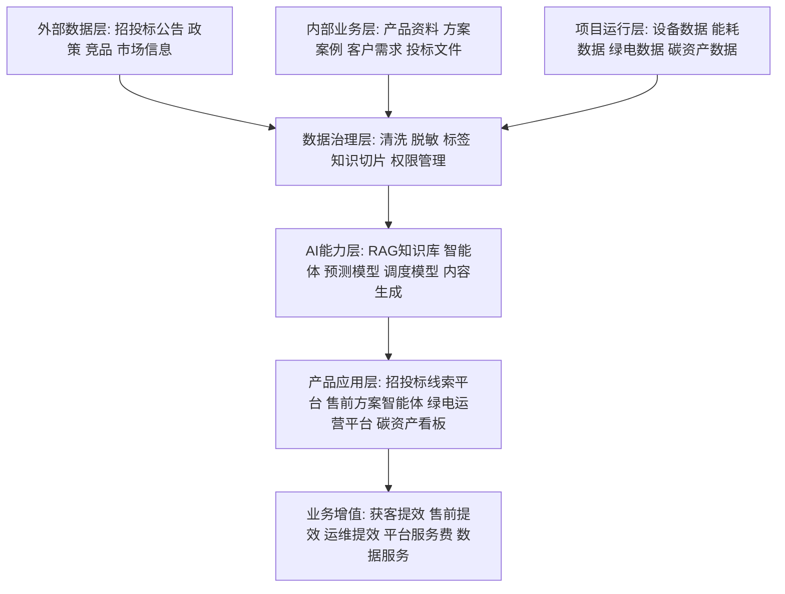

# 任务11：AI产品架构与数据资产增值规划

## 一句话定位

把绿电微网公司的招投标数据、客户需求、产品资料、项目交付数据、运维能耗数据沉淀为统一数据资产，并通过 AI 智能体、运营平台和行业解决方案实现业务增值。

## 成果文件名

`任务11_绿电微网AI产品架构与数据资产增值规划.md`

## 推荐架构图

## 输出结构

### 1. 公司数据资产盘点

| 数据类型 | 来源 | 价值 |
| --- | --- | --- |
| 招投标数据 | 南方电网、采购平台、政府采购 | 获客线索、市场趋势、投标策略 |
| 产品技术资料 | 设备参数、方案书、白皮书 | 智能体问答、方案生成、销售培训 |
| 客户需求数据 | 售前沟通、调研表、项目需求书 | 客户画像、方案推荐 |
| 项目交付数据 | 项目图纸、交付清单、验收材料 | 标准化交付、案例复用 |
| 运维能耗数据 | 电表、光伏、储能、充电桩、平台日志 | AI调度、节能分析、碳资产 |

### 2. AI产品架构

#### 数据层

- 外部市场数据
- 内部知识资料
- 项目运行数据
- 客户与商机数据

#### 能力层

- RAG 行业知识库
- 售前问答智能体
- 招投标线索分类模型
- 绿电消纳分析模型
- AI 智能调度模型
- 碳资产计算与报告生成

#### 应用层

- 招投标线索雷达
- 绿电微网解决方案智能体
- 直流运营管理平台
- 碳资产数据看板
- 投标方案生成助手

### 3. 数据资产增值路径

1. 数据可见：把分散数据统一采集和归档
2. 数据可用：清洗、标签化、权限管理
3. 数据可问：接入知识库和智能体
4. 数据可算：用于预测、调度、收益测算
5. 数据可卖：形成平台服务费、运维服务费、数据分析报告、行业解决方案

### 4. 分阶段路线图

| 阶段 | 时间 | 目标 |
| --- | --- | --- |
| MVP | 1-2个月 | 招投标线索分类 + 售前知识库智能体 |
| V1 | 3-6个月 | 接入项目数据，形成运营看板和方案生成 |
| V2 | 6-12个月 | 建立绿电消纳、AI调度、碳资产量化能力 |
| V3 | 12个月以上 | 对外输出平台服务和行业数据服务 |

### 5. 风险控制

- 数据合规：客户数据脱敏、权限隔离
- 幻觉控制：智能体回答引用来源，不确定就提示人工确认
- 安全控制：AI 调度建议需要人工确认后执行
- 商业控制：不把未验证节能收益写成承诺

## 成功标志

- 能讲清楚数据从哪里来
- 能讲清楚数据如何治理
- 能讲清楚 AI 产品如何承接业务
- 能讲清楚公司如何通过数据资产增值

