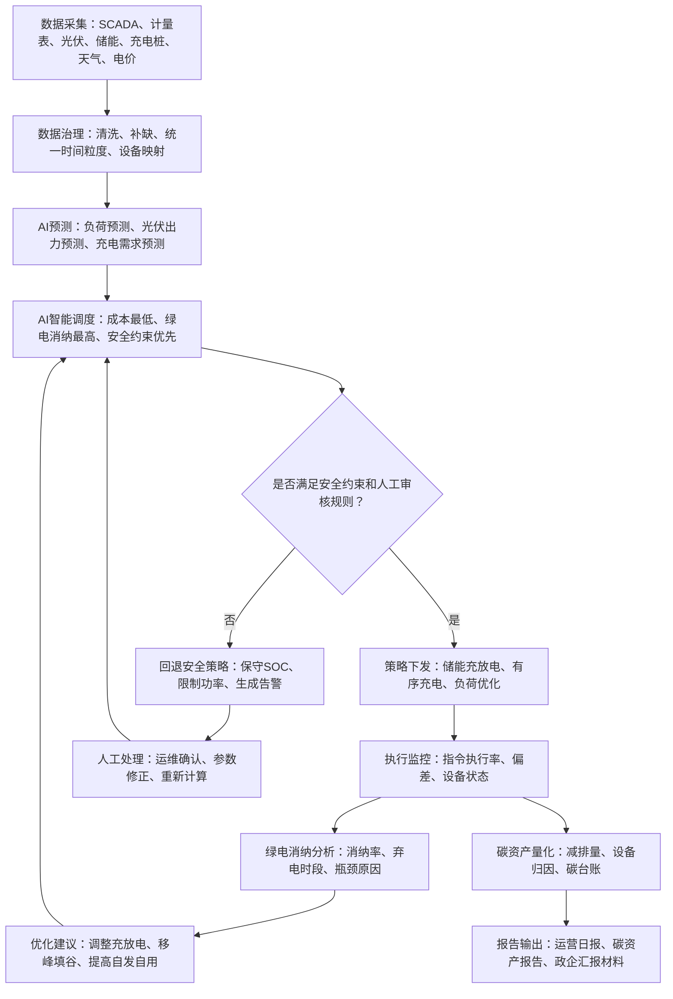

# 任务4 Codex辅助产出：表格、字段与流程图

## 1. Codex 执行范围

本文件对应现场执行总览中任务4的 Codex 部分：批量生成 PRD 表格、字段清单和 Mermaid 业务流程图。最终产品判断仍由产品经理人工完成，Codex 只负责结构化提效。

## 2. 用户痛点与功能映射表

| 用户类型 | 业务目标 | 高频痛点 | 对应 AI 能力 | 关键输出 |
| --- | --- | --- | --- | --- |
| 园区运营方 | 降低综合用能成本，提高绿电自用比例 | 负荷波动大、设备分散、绿电消纳不透明、碳减排难向业主解释 | 负荷预测、绿电消纳分析、碳资产看板 | 用能优化建议、消纳率曲线、碳减排月报 |
| 数据中心运维方 | 保证供电可靠性，降低 PUE 和碳排压力 | 负荷连续高位、供电可靠性要求高、储能/UPS调度复杂 | AI智能调度、异常预警、能效分析 | 调度策略、供电风险告警、能效对比报表 |
| 充电站运营商 | 提升充电服务率，降低峰时电费，证明绿色充电价值 | 高峰排队、低谷空置、电价波动、绿电充电比例不可证明 | 有序充电、储能充放电优化、绿电充电占比统计 | 充电排班策略、收益测算、绿色充电证明 |

## 3. 三大核心模块功能清单

| 模块 | 功能点 | 输入数据 | 处理逻辑 | 输出结果 | 验收标准 |
| --- | --- | --- | --- | --- | --- |
| AI智能调度 | 负荷预测 | 历史负荷、天气、节假日、实时功率 | 基于时序模型预测未来 4h/24h 负荷 | 负荷预测曲线 | 4h预测误差 MAPE <= 10% |
| AI智能调度 | 光伏出力预测 | 历史发电量、辐照度、温度、天气预报 | 预测未来发电能力 | 光伏出力曲线 | 日前预测误差 MAPE <= 15% |
| AI智能调度 | 储能充放电策略 | 电价、负荷预测、发电预测、SOC、设备约束 | 多目标优化：成本最低、消纳最高、安全优先 | 充放电时序表 | 较人工策略电费下降目标待确认 |
| AI智能调度 | 有序充电策略 | 预约订单、桩状态、电价、站内负荷 | 分配充电时段和功率 | 充电排班策略 | 高峰过载次数下降，用户等待时间可量化 |
| 绿电消纳分析 | 消纳率统计 | 发电时序、负荷时序、上网电量 | 计算自发自用、余电上网、弃电 | 消纳率曲线 | 支持 15 分钟粒度 |
| 绿电消纳分析 | 弃电诊断 | 发电量、负荷、储能SOC、设备状态 | 判断弃电发生原因 | 弃电原因列表 | 可定位到时段和主要设备 |
| 绿电消纳分析 | 优化建议生成 | 消纳瓶颈、设备能力、调度策略 | 生成可执行优化建议 | 建议清单 | 建议可推送到调度模块 |
| 碳资产量化 | 碳减排计算 | 绿电用量、电网排放因子、基准线参数 | 按方法学计算 tCO2e | 实时减排量 | 计算口径可追溯 |
| 碳资产量化 | 设备级归因 | 设备发电/节电/用电数据 | 按贡献分摊碳减排量 | 设备碳贡献表 | 支持场站-设备两级下钻 |
| 碳资产量化 | 报告导出 | 碳台账、方法学、周期参数 | 生成可汇报材料 | PDF/Excel报告 | 支持政府/客户汇报口径 |

## 4. 核心数据字段表

| 数据对象 | 字段名 | 类型 | 示例 | 用途 | 备注 |
| --- | --- | --- | --- | --- | --- |
| 场站 | station_id | string | SZ-PARK-001 | 唯一识别场站 | 必填 |
| 场站 | station_type | enum | park / data_center / charging_station | 区分场景模型 | 必填 |
| 设备 | device_id | string | PCS-001 | 唯一识别设备 | 必填 |
| 设备 | device_type | enum | pv / storage / charger / load / meter | 设备分类 | 必填 |
| 实时计量 | timestamp | datetime | 2026-07-08 10:15:00 | 时序对齐 | 15分钟粒度优先 |
| 实时计量 | power_kw | number | 350.5 | 当前功率 | 调度和看板使用 |
| 实时计量 | energy_kwh | number | 87.6 | 周期电量 | 计费和碳核算使用 |
| 储能状态 | soc_percent | number | 62.5 | 储能荷电状态 | 调度约束 |
| 电价 | tariff_price | number | 0.92 | 分时电价 | 调度优化 |
| 预测结果 | forecast_load_kw | number | 420.0 | 预测负荷 | AI调度输入 |
| 预测结果 | forecast_pv_kw | number | 180.0 | 预测发电 | AI调度输入 |
| 调度策略 | action_type | enum | charge / discharge / curtail / idle | 调度动作 | 需安全校验 |
| 调度策略 | action_power_kw | number | 120.0 | 动作功率 | 下发前人工确认 |
| 碳资产 | emission_factor | number | 待确认 | 电网排放因子 | 需跟随官方口径更新 |
| 碳资产 | carbon_reduction_tco2e | number | 1.25 | 碳减排量 | 报表核心指标 |
| 消纳分析 | local_consumption_rate | number | 86.3 | 本地消纳率 | 看板核心指标 |

## 5. 页面与交互逻辑表

| 页面 | 核心内容 | 用户操作 | 系统反馈 | 异常处理 |
| --- | --- | --- | --- | --- |
| 运营首页 | 负荷、绿电消纳、储能SOC、碳减排、告警 | 切换场站/时间范围 | 刷新指标和趋势图 | 数据延迟时显示最近更新时间 |
| AI调度页 | 预测曲线、调度建议、预期收益、风险提示 | 确认/修改/驳回调度策略 | 生成调度任务并记录日志 | 策略越限时禁止下发 |
| 消纳分析页 | 消纳率曲线、弃电热力图、瓶颈原因 | 点击时段查看明细 | 展示原因和建议 | 数据缺失时提示补采或估算 |
| 碳资产页 | 实时减排量、累计碳资产、设备贡献、报告导出 | 选择周期并导出报告 | 生成 PDF/Excel | 方法学缺失时阻断报告生成 |
| 告警中心 | 设备异常、预测偏差、调度失败、数据中断 | 确认/派单/关闭告警 | 更新告警状态 | 关键告警需二次确认 |

## 6. 业务流程图 Mermaid 代码

## 7. 现场表达口径

这部分我会说成：Codex 主要承担结构化提效，不替代产品判断。它适合批量生成字段、表格、流程图这类低上下文任务；最终的功能优先级、行业边界、安全机制和合规口径，由我人工校验后写入 PRD。
