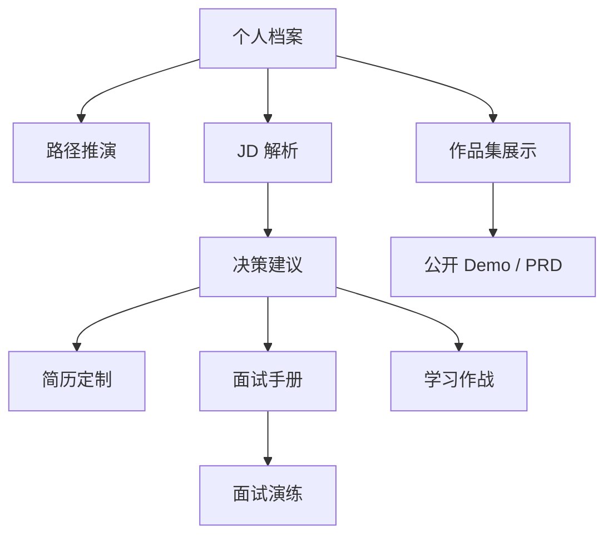
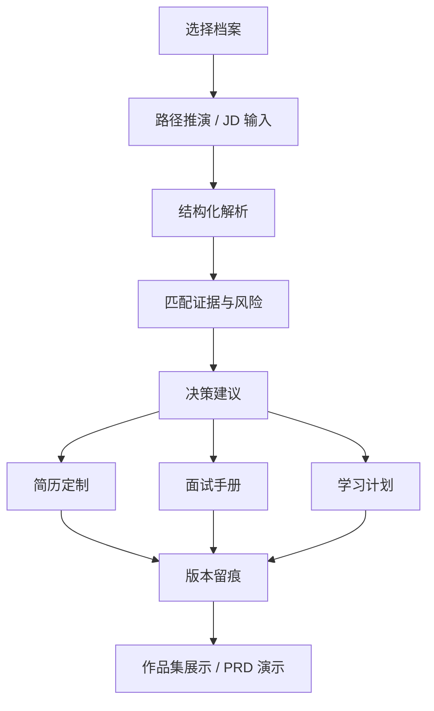

# Studio · 求职作战中心 PRD

## 0. 文档说明

| 项目 | 内容 |
| --- | --- |
| 文档版本 | v0.1 |
| 创建日期 | 2026-07-08 |
| 作者 | 皮玺玉 / Codex PRD Writer Skill |
| 当前状态 | 待评审 |
| 文档用途 | 作为个人站“求职作战中心”项目的面试演示 PRD，说明产品定位、MVP 范围、工作流、验收标准和风险边界。 |

### 0.1 修订记录

| 版本 | 日期 | 修订人 | 修订内容 | 修订原因 | 审核人 |
| --- | --- | --- | --- | --- | --- |
| v0.1 | 2026-07-08 | Codex | 初版创建，补充 PRD 网页演示入口 | 个人站求职作战项目需要可打开 PRD | 皮玺玉待确认 |

### 0.2 名词术语

| 词汇 | 别名 | 说明 |
| --- | --- | --- |
| 求职作战中心 | Studio | 面向个人求职流程的 AI Agent 工作台。 |
| 个人档案 | Profile | 求职者的经历、项目、技能、偏好、约束和素材库。 |
| JD 决策 | Job Decision | 对目标岗位进行匹配、风险、投入产出和行动建议判断。 |
| 信息分级铁律 | Fact Boundary | AI 只能基于已确认事实输出，未知数据必须标记待确认，不编公司事实、量化数字和未来预测。 |
| 演示模式 | Demo Profile | 使用虚拟档案和只读数据向面试官展示完整流程，不暴露真实隐私。 |

## 1. 背景与目标

### 1.1 背景

求职过程不是一次性写简历，而是持续整理信息、判断岗位、定制材料、准备面试、复盘反馈的复杂链路。用户常见问题是材料散、JD 判断靠感觉、AI 容易编事实、每次投递都从零开始。求职作战中心把这些动作整理成一个本地优先的 AI Agent 工作台，让求职材料、决策过程和交付产物可追踪、可复用、可演示。

### 1.2 目标用户

| 用户类型 | 用户特征 | 核心场景 | 主要痛点 |
| --- | --- | --- | --- |
| 转岗/求职中的产品经理 | 有项目经历但表达分散，需要面向岗位包装 | 看 JD、改简历、准备面试、输出作品集讲法 | 简历和项目讲法无法稳定匹配岗位 |
| AI 工具实践者 | 需要证明自己不是只会 prompt，而能做产品闭环 | 向面试官展示 AI 产品思考和工程落地 | 项目很多但难讲成一条业务链路 |
| 面试官/HR | 希望快速判断候选人的产品、AI、工程能力 | 打开 Demo 和 PRD 看项目结构 | 不想看零散截图和难复现本地服务 |

### 1.3 业务目标与成功指标

| 目标 | 衡量指标 | 当前基线 | 目标值 | 统计周期 |
| --- | --- | --- | --- | --- |
| 让求职流程产品化 | 完整链路模块覆盖数 | 已覆盖档案、JD、简历、面试、学习、作品集 | MVP 覆盖 6 个核心模块 | 面试前 |
| 降低公开演示隐私风险 | 演示模式是否只用虚拟档案 | 已有 demo profile | 线上 Demo 可直接打开且不暴露真实档案 | 每次发布 |
| 提升面试讲解效率 | 面试官 3 分钟内能理解项目 | 待统计 | 通过 PRD + Demo 形成可讲路径 | 每次面试 |
| 降低 AI 编造风险 | 未确认事实标记率 | 待统计 | 所有公司事实、数字、预测均标记来源或待确认 | 每次输出 |

### 1.4 价值分析

- 用户价值: 把求职材料、判断、改稿和面试准备从“临时聊天”变成可复盘的工作台。
- 产品价值: 证明 AI Agent 可以落在真实高频任务上，而不是单次问答。
- 面试价值: 面试官能同时看到产品拆解、工程实现、AI 使用边界和公开演示意识。

## 2. 范围定义

### 2.1 一句话产品定义

Studio · 求职作战中心是在本地优先和隐私隔离前提下，为求职者提供个人档案、路径推演、JD 决策、简历定制、面试演练、学习作战和作品集展示的 AI Agent 工作台。

### 2.2 MVP 范围

| 优先级 | 功能 | 解决的问题 | 说明 |
| --- | --- | --- | --- |
| Must | 个人档案与素材库 | 避免每次重新介绍自己 | 保存经历、项目、技能、偏好、约束和可复用素材。 |
| Must | JD 解析与决策建议 | 避免盲投和 AI 编造 | 解析岗位要求、匹配证据、风险点和行动建议。 |
| Must | 简历与面试产物生成 | 把判断转成可投递材料 | 输出简历改写建议、面试手册、STAR 讲法和追问准备。 |
| Should | 路径推演 | 帮用户选择求职方向 | 按目标岗位、能力缺口和样例公司生成路径建议。 |
| Should | 学习作战计划 | 把能力缺口转成行动 | 生成阶段学习任务、产物和复盘标准。 |
| Should | 作品集展示口径 | 方便公开演示 | 整理项目背景、功能模块、Demo 链接、讲法和风险边界。 |

### 2.3 本版不做

| 不做项 | 原因 | 后续计划 |
| --- | --- | --- |
| 自动投递岗位 | 涉及平台账号、反爬、隐私和误投风险 | 仅保留人工确认后的外部跳转方向。 |
| 真实公司信息自动断言 | 容易生成过期或错误事实 | 需要来源链接和人工确认后再进入材料。 |
| 付费求职服务闭环 | 当前以作品集和个人工具验证为主 | 有真实咨询需求后单独立项。 |
| 多用户 SaaS 权限体系 | MVP 是本地优先个人工作台 | 后续可评估账号、同步和团队版。 |

### 2.4 约束与假设

| 类型 | 内容 | 状态 |
| --- | --- | --- |
| 约束 | 真实档案和求职材料优先本地保存，不默认上传公开站点。 | 已确认 |
| 约束 | 公开 Demo 必须使用虚拟档案和只读数据。 | 已确认 |
| 假设 | 当前面试演示以 AI 产品经理 / B 端产品方向为主要讲解场景。 | 待确认 |
| 假设 | 模型供应商、价格和可用能力会变化，PRD 中不写死实时价格。 | 已确认 |

## 3. 产品方案

### 3.1 功能结构

### 3.2 信息结构

| 对象 | 核心字段 | 用途 |
| --- | --- | --- |
| Profile | 基本信息、经历、项目、技能、偏好、限制 | 作为所有生成任务的事实来源。 |
| JD | 岗位名称、公司、职责、要求、链接、来源时间 | 用于解析和匹配。 |
| Decision | 匹配度、证据、风险、行动建议、待确认项 | 帮用户决定是否投入。 |
| Resume Draft | 版本、目标岗位、亮点、项目表述、修改原因 | 形成可投递材料。 |
| Interview Pack | 自我介绍、项目讲法、STAR 案例、追问、反问 | 形成面试准备包。 |
| Portfolio Item | 项目背景、模块、Demo、讲法、边界 | 用于公开作品集展示。 |

### 3.3 业务流程

1. 用户建立或选择个人档案。
2. 系统根据目标方向做路径推演，给出推荐岗位类型和能力缺口。
3. 用户输入或粘贴 JD，系统解析职责、要求和风险。
4. 系统基于个人档案输出匹配证据、缺口、决策建议和待确认项。
5. 用户确认目标后生成简历改写建议、面试手册和学习计划。
6. 用户把可公开项目同步到作品集展示口径。
7. 面试时使用演示档案和 PRD 页面展示完整闭环。

### 3.4 页面流程

| 页面/模块 | 进入方式 | 主要动作 | 退出/跳转 |
| --- | --- | --- | --- |
| 档案页 | 首页或设置入口 | 查看、编辑、锁定档案 | 进入路径推演或 JD 解析 |
| 路径推演 | 选择目标方向 | 生成方向建议和公司样例 | 进入学习作战或 JD 决策 |
| JD 解析 | 输入 JD 链接/文本 | 结构化岗位要求 | 进入决策建议 |
| 简历定制 | 决策后触发 | 生成改写建议和版本说明 | 导出 Markdown / 复制 |
| 面试演练 | 面试包入口 | 生成追问和回答框架 | 复盘或返回面试包 |
| 作品集展示 | 项目模块入口 | 预览项目讲法和 Demo | 打开线上 Demo / PRD |

## 4. 全局规则

### 4.1 权限与角色

| 角色/状态 | 可见内容 | 可操作内容 | 限制 |
| --- | --- | --- | --- |
| 本人本地使用 | 真实档案、真实 JD、真实简历版本 | 编辑、生成、导出、复盘 | 不默认公开。 |
| 面试官演示 | 虚拟档案、演示数据、公开 Demo、PRD | 只读浏览 | 不能进入真实档案。 |
| 开发/维护者 | 配置、日志、模型路由、演示数据 | 调试、发布、更新文档 | 不能把密钥和真实隐私提交到仓库。 |

### 4.2 全局状态

| 状态 | 展示规则 | 用户操作 | 系统处理 |
| --- | --- | --- | --- |
| 空状态 | 给出示例档案/JD 模板 | 新建或导入 | 不自动生成空内容。 |
| 加载中 | 显示当前任务名称和阶段 | 等待或取消 | 保留已有结果。 |
| 模型失败 | 显示失败原因和兜底说明 | 重试或改用本地摘要 | 不返回硬编码假结果。 |
| 事实不确定 | 标记“待确认” | 用户补充来源 | 未确认前不进入最终简历。 |
| 演示模式 | 明确显示演示档案 | 只读预览 | 禁止保存到真实档案。 |

### 4.3 文案与交互规范

- 所有岗位和公司事实必须说明来源或标记待确认。
- 简历产物要说明“为什么这样改”，不是只给结果。
- 面试包要优先输出可讲案例、追问准备和风险兜底。
- 公开演示页避免出现“给面试官看”这类不必要前台字眼，但 PRD 可说明演示用途。

## 5. 需求列表

| 编号 | 模块 | 需求 | 类型 | 优先级 | 迭代 | 说明 |
| --- | --- | --- | --- | --- | --- | --- |
| R1 | 个人档案 | 建立事实来源和素材库 | 功能 | P0 | MVP | 所有 AI 输出都必须引用或基于档案。 |
| R2 | JD 解析 | 结构化岗位信息和要求 | 功能 | P0 | MVP | 支持文本输入，链接解析能力视环境可用。 |
| R3 | 决策建议 | 输出匹配证据、风险和行动建议 | 功能 | P0 | MVP | 不做“必过”预测。 |
| R4 | 简历定制 | 生成面向目标岗位的修改建议 | 功能 | P0 | MVP | 保留版本和修改理由。 |
| R5 | 面试演练 | 生成项目讲法、追问和回答框架 | 功能 | P1 | MVP | 重点服务面试准备。 |
| R6 | 学习作战 | 把能力缺口拆成行动计划 | 功能 | P1 | MVP | 输出任务、产物和验收。 |
| R7 | 演示模式 | 使用虚拟档案和只读数据公开演示 | 安全 | P0 | MVP | 不暴露真实隐私。 |
| R8 | 作品集展示 | 输出可公开项目讲法和 Demo 链接 | 运营 | P1 | MVP | 连接个人站。 |

## 6. 需求详情

### R1. 个人档案与素材库

#### 6.1 用户故事

作为求职者，我希望把个人经历、项目、技能和偏好整理成一个可复用档案，以便每次 JD 解析和简历定制都有稳定事实来源。

#### 6.2 业务规则

1. 档案字段分为已确认事实、可包装表达和待确认材料。
2. AI 不得把待确认材料直接写入最终简历。
3. 演示档案与真实档案必须隔离。

#### 6.3 字段与数据

| 字段 | 类型 | 是否必填 | 默认值 | 校验规则 | 说明 |
| --- | --- | --- | --- | --- | --- |
| profileId | string | 是 | 自动生成 | 唯一 | 档案标识。 |
| projects | array | 是 | [] | 每项需有项目名和角色 | 用于项目讲法。 |
| skills | array | 否 | [] | 文本长度限制 | 技能标签。 |
| constraints | array | 否 | [] | 可为空 | 地点、行业、岗位、隐私限制。 |

#### 6.4 验收标准

- Given 用户打开演示档案, When 查看内容, Then 只能看到虚拟资料。
- Given 用户生成简历建议, When 档案缺少证据, Then 系统必须提示待补充而不是编造。

### R2. JD 解析与决策建议

#### 6.1 用户故事

作为求职者，我希望系统能把 JD 拆成职责、要求、风险和匹配证据，以便判断是否值得投入。

#### 6.2 业务规则

1. JD 输出必须区分原文信息、系统推断和待确认。
2. 匹配建议必须引用档案里的项目或经历作为证据。
3. 不输出“录取概率”“薪资预测”等无来源结论。

#### 6.3 验收标准

- Given 用户输入 JD 文本, When 点击解析, Then 系统输出职责、硬性要求、软性要求、风险点和待确认项。
- Given JD 中出现公司信息, When 无可靠来源, Then 标记为待确认。

### R3. 简历定制与面试演练

#### 6.1 用户故事

作为求职者，我希望系统把 JD 决策结果转成简历改写建议和面试讲法，以便形成可投递、可演练的材料。

#### 6.2 业务规则

1. 简历建议必须包含修改前后方向和修改理由。
2. 面试手册应覆盖自我介绍、项目 STAR、风险问题、反问建议。
3. 所有材料支持复制或导出 Markdown。

#### 6.3 验收标准

- Given 用户已有 JD 决策, When 生成面试包, Then 输出自我介绍、项目讲法、追问准备和反问建议。
- Given 用户切换岗位, When 重新生成, Then 保留版本，不覆盖旧产物。

## 7. 非功能需求

| 类型 | 要求 | 指标/标准 | 说明 |
| --- | --- | --- | --- |
| 隐私 | 真实档案本地优先保存 | 公开 Demo 不含真实隐私 | 求职材料敏感度高。 |
| 稳定性 | 模型失败可重试或降级 | 不返回假数据 | 避免演示现场误导。 |
| 可维护性 | 内容和项目入口结构化 | 新项目不大改组件 | 与个人站 content JSON 模式一致。 |
| 兼容性 | Demo 可线上打开 | 桌面浏览器优先 | 面试官不需要本地环境。 |
| 可解释性 | AI 输出说明依据 | 关键建议有证据或待确认 | 防止黑盒建议。 |

## 8. 埋点与数据

| 事件名 | 触发时机 | 参数 | 参数说明 | 用途 |
| --- | --- | --- | --- | --- |
| profile_open | 打开档案 | profileType | demo / real | 判断演示和真实使用分布。 |
| jd_parse | 解析 JD | sourceType | text / url / file | 分析 JD 输入方式。 |
| decision_generate | 生成决策建议 | jobRole, riskCount | 岗位和风险数 | 判断决策模块使用情况。 |
| resume_export | 导出简历建议 | format | md / copy | 追踪产物交付。 |
| interview_pack_open | 打开面试包 | jobId | 目标岗位 | 判断面试准备使用率。 |
| portfolio_demo_click | 打开作品集 Demo | projectId | 项目标识 | 支撑个人站复盘。 |

## 9. 项目计划

| 阶段 | 开始时间 | 结束时间 | 交付物 | 负责人 | 状态 | 风险 |
| --- | --- | --- | --- | --- | --- | --- |
| D0 事实盘点 | 已完成 | 已完成 | 项目定位、模块、演示入口 | 皮玺玉 / Codex | 已完成 | 真实隐私需隔离。 |
| D1 PRD 演示页 | 2026-07-08 | 2026-07-08 | PRD Markdown + HTML | Codex | 进行中 | 需同步个人站入口。 |
| D2 演示链路复核 | 待确认 | 待确认 | 首页项目卡片、Demo、PRD 可打开 | 皮玺玉 | 待开始 | 线上缓存和链接失效。 |
| D3 求职材料迭代 | 待确认 | 待确认 | 最新作品集讲法、简历材料 | 皮玺玉 | 待开始 | 不同岗位口径差异。 |

## 10. 工作流设计

### 10.1 开发工作流

| 角色/工具 | 主要用途 | 输入 | 输出 | 注意事项 |
| --- | --- | --- | --- | --- |
| Codex | 实现、调试、测试、PRD 页面生成、个人站入口更新 | 需求、项目文件、现有 Demo | 代码、文档、构建验证、push | 修改中文文件必须避免乱码。 |
| Claude | PRD / 架构 / 复杂逻辑复核 | PRD、代码、提示词 | 评审建议 | 是否使用待确认。 |
| Tuzi API | 产品运行时模型网关 | JD、档案、生成任务 | 结构化解析、总结、改写 | 模型、价格、tools 支持均待确认。 |
| Vercel / GitHub Pages | 公开演示承载 | 前端构建包 | 线上 Demo / PRD | 后端 API 与静态站能力边界需说明。 |

### 10.2 AI 开发成本、产出预估与 ROI

| 统计项 | 口径 | 状态 |
| --- | --- | --- |
| 统计范围 | 需求、PRD、前端、后端、演示、测试、上线准备 | 待确认 |
| 平台范围 | Codex、Claude、Tuzi API、Vercel、GitHub Pages | 待确认 |
| Token 指标 | 输入、输出、缓存/思考、总 tokens | 待统计 |
| 金额指标 | 单平台金额、总金额、币种、是否含订阅费 | 待统计 |
| 收益口径 | 节省求职材料准备时间、减少返工、提升面试表达质量 | 待确认 |

预估成本表：

| 阶段 | 平台/工具 | 任务 | 预计轮次/调用量 | 预计输入 tokens | 预计输出 tokens | 单价/计费口径 | 预估金额 | 币种 | 估算依据 | 置信度 |
| --- | --- | --- | --- | --- | --- | --- | --- | --- | --- | --- |
| PRD 与页面 | Codex | 生成 PRD、HTML、入口更新 | 待统计 | 待统计 | 待统计 | 订阅/平台口径待确认 | 待统计 | 待确认 | 本次任务记录 | 中 |
| 评审 | Claude | PRD 或代码复核 | 待确认 | 待确认 | 待确认 | 待确认 | 待确认 | 待确认 | 是否使用待确认 | 低 |
| 运行时 | Tuzi API | JD 解析、总结、改写 | 待估算 | 待估算 | 待估算 | 价格需实时核验 | 待估算 | 待确认 | Tuzi pricing 待确认 | 低 |

预估产出表：

| 产出类型 | 预估产出 | 数量/范围 | 验收标准 | 价值口径 | 预估价值 | 状态 |
| --- | --- | --- | --- | --- | --- | --- |
| 文档 | PRD Markdown + HTML | 2 个文件 | 可打开、可讲、可维护 | 减少讲解准备时间 | 待估算 | 本次已交付 |
| 功能 | 个人站项目入口 | 1 个 action | 项目弹窗可打开 PRD | 提升面试演示完整度 | 待估算 | 本次已交付 |
| 演示资产 | 虚拟档案 Demo 链路 | 1 条链路 | 不暴露真实隐私 | 降低公开演示风险 | 待估算 | 已有基础 |

### 10.3 产品运行工作流

### 10.4 模型与工具路由

| 任务 | 默认工具/模型 | 兜底方案 | 选择理由 | 风险/待确认 |
| --- | --- | --- | --- | --- |
| JD 结构化 | Tuzi API 可用模型 | 本地规则解析 + 人工补充 | 需要稳定 JSON 结构 | 模型和价格待确认 |
| 简历改写 | Claude / GPT / DeepSeek | 模板化建议 | 需要表达质量和事实边界 | 不可编造经历 |
| 公司信息 | Web Search / 用户提供来源 | 标记待确认 | 公司事实容易过期 | 需要实时来源 |
| 面试追问 | Claude / GPT | 固定追问题库 | 长文本推理和表达更重要 | 需要控制输出长度 |

### 10.5 配置与安全

| 项目 | 建议 | 状态 |
| --- | --- | --- |
| API Key | 只放后端环境变量，不写入前端和 Git | 已确认 |
| Demo Profile | 使用虚拟档案和只读参数 | 已确认 |
| 真实档案 | 本地优先，不进入 GitHub Pages | 已确认 |
| 日志 | 不提交 `data/*.jsonl` 本地行为日志 | 已确认 |
| 线上后端 | Vercel serverless 与 GitHub Pages 静态站能力分开说明 | 待确认 |

## 11. 风险与待确认

| 编号 | 风险/问题 | 影响 | 处理建议 | 状态 |
| --- | --- | --- | --- | --- |
| Q1 | 求职材料包含个人隐私 | 公开演示泄露真实经历、联系方式或求职方向 | 所有公开 Demo 使用虚拟档案 | 已处理 |
| Q2 | AI 生成不真实公司事实 | 简历或面试话术失真 | 公司事实必须有来源或标记待确认 | 已处理 |
| Q3 | 模型能力和价格变化 | 成本估算失准，功能不可用 | 模型、价格和 tools 支持按发布前实时核验 | 待确认 |
| Q4 | 面试现场网络不稳定 | Demo 打不开影响展示 | 准备截图/录屏和 PRD 静态页兜底 | 待确认 |
| Q5 | 入口过多导致讲解分散 | 面试时间被稀释 | 主讲求职作战 + 采购看板，其他项目作为补充 | 待确认 |

## 12. 附录

- 线上 Demo: `https://ai-job-war-room-studio.vercel.app/?profile=demo&profile_lock=demo`
- 个人站项目入口: `content/projects.json` 中 `job-war-room`
- 本 PRD 网页: `/docs/job-war-room-prd.html`
- 本 PRD Markdown: `/docs/job-war-room-prd.md`
