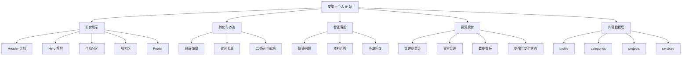
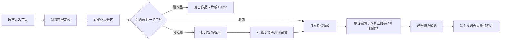
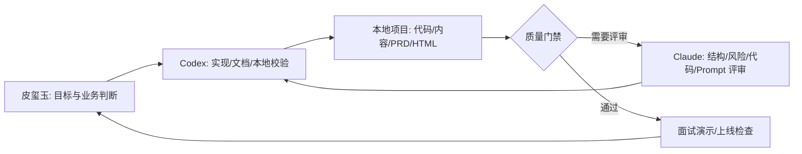
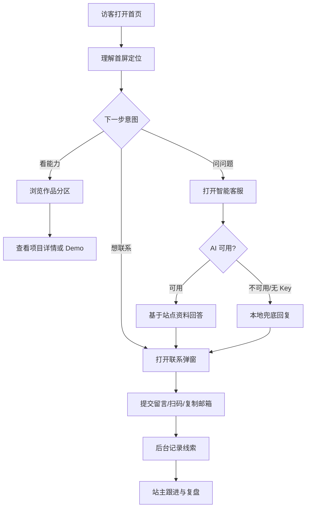

# 皮玺玉个人 IP 站 PRD

## 0. 文档说明

| 项目 | 内容 |
| --- | --- |
| 文档版本 | v1.3 |
| 创建日期 | 2026-05-31 |
| 文档状态 | 待评审 |
| 项目类型 | Web 个人 IP 展示站 / 作品集 / 商业服务入口 |
| 当前版本定位 | 面试演示作品集版 |
| 后续产品方向 | 上线小程序商业化（待独立立项） |
| 产品负责人 | 皮玺玉 |
| 技术形态 | Vue 3 + Vite 7 + Node 原生 HTTP API |
| 输出范围 | 本 PRD 整理当前项目主站、智能客服、留言、运营后台、埋点与上线风险 |

### 0.1 修订记录

| 版本 | 日期 | 修订人 | 修订内容 | 修订原因 | 审核人 |
| --- | --- | --- | --- | --- | --- |
| v1.0 | 2026-05-31 | Codex | 基于现有需求草案、智能客服 MVP PRD、代码和 content 数据整理标准 PRD | 项目已有实现，需要形成统一评审文档 | 皮玺玉确认 |
| v1.1 | 2026-05-31 | Codex | 补充面试演示版定位、环境配置清单、隐私数据说明、运营指标、内容更新 SOP、测试用例和商业转化边界 | 明确当前版本用于面试演示，后续小程序商业化另行规划 | 皮玺玉确认 |
| v1.2 | 2026-05-31 | Codex | 按更新后的 PRD Skill 重新生成，新增工作流设计、AI 开发成本/产出/ROI 追踪、SOP 与进度标注 | 用户要求重新生成 PRD，并生成工作流、SOP、标注进度 | 皮玺玉确认 |
| v1.3 | 2026-05-31 | Codex | 细化工作流设计，补充默认 Codex + Claude + Tuzi API 环境、阶段门禁、角色泳道、运行链路、异常兜底和度量口径 | 用户要求细化工作流设计 | 皮玺玉确认 |

### 0.2 名词术语

| 词汇 | 别名 | 说明 |
| --- | --- | --- |
| 皮玺玉 | 站点主人 | 产品经理 × AI 实践者，个人 IP 主体 |
| AI 貔貅 | 吉祥物 / IP 副本 | 负责“囤工作流”的视觉与文案载体 |
| 作品卡片 | Project Card | 展示 AI 工作流、Skill、工具或服务的卡片 |
| 状态徽章 | Live / WIP / Idea / Paid | 标识作品是否可体验、进行中、想法阶段或付费服务 |
| 私域入口 | 微信 / 小红书 / 邮箱 / 留言 | 访客进一步联系皮玺玉的入口 |
| 智能客服 | ChatWidget | 右下角 AI 对话浮窗，用于回答个人介绍、作品、服务和联系问题 |
| 运营后台 | AdminDashboard | `/admin` 路径下的留言与访问数据管理页面 |

## 1. 需求诊断与概念对齐

### 1.1 三视角诊断

| 视角 | 结论 |
| --- | --- |
| 用户视角 | 访客需要在很短时间内看懂“皮玺玉是谁、做过什么、能帮我什么、怎么联系”。目标用户包括招聘方、合作方、同行、潜在客户和未来学员。 |
| 商业视角 | 当前站点是个人品牌沉淀与商业转化入口。先通过免费作品和 Skill 展示能力，再引导定制咨询、工作流外包、培训或私域沟通。 |
| 技术视角 | 当前采用轻量 Web App：Vue 3 前台、content JSON 数据驱动、Node API 处理留言/埋点/智能客服/后台。AI 接口通过后端读取 API Key，避免前端泄露。 |

### 1.2 概念版对齐

| 项目 | 内容 |
| --- | --- |
| 一句话产品定义 | 一个数据驱动的个人 IP 作品集站点，用“皮玺玉 × AI 貔貅”的统一叙事展示 AI 工作流作品，并承接联系、咨询和商业服务转化。 |
| 目标用户 | 招聘方、潜在客户、同行 / 产品经理 / AI 爱好者、未来学员。 |
| 核心场景 | 访客打开站点后，30 秒内理解个人定位，浏览代表作品，通过客服或联系弹窗进一步咨询。 |
| MVP 核心功能 | 作品集展示、联系/留言转化、智能客服问答。 |
| 平台选择 | Web 单页站点，兼容桌面端和移动端；后端 Node API 本地或线上部署。 |
| 当前阶段 | 面试演示作品集版：重点证明产品思考、AI 工作流实践、前后端实现能力和项目复盘能力。 |
| 后续阶段 | 小程序商业化版：待验证面试演示和私域反馈后，单独立项设计交易、服务交付、会员或课程体系。 |
| 本版不做 | 在线支付、用户登录、复杂 CMS、自动报价、多人客服坐席、多语言站点。 |
| 成功标志 | 访客能在 1 分钟内获得个人介绍、作品概览或联系入口；站主能在后台查看留言和基础访问行为。 |
| 关键风险 | 默认后台密码、AI API Key、邮件提醒配置、域名和上线环境、真实转化指标仍需确认。 |

## 2. 背景与目标

### 2.1 背景

皮玺玉已经沉淀了多个跨领域 AI 实践项目，包括求职作战中心、采购预警看板、PRD Skill、漫剧生产工作流、脚本 Skill、健康管理想法等。这些内容如果只以零散链接、截图或文档存在，访客难以快速理解整体能力，也不利于后续商业转化。

本项目用“皮玺玉养了一只 AI 貔貅，替她囤住生活里的工作流”作为统一叙事，把采购、求职、PRD、内容创作、健康等跨领域项目包装为同一个 IP 下的作品资产。站点同时承担作品展示、个人品牌、私域引流、留言收集和智能咨询入口。

### 2.2 目标用户

| 用户类型 | 用户特征 | 核心场景 | 主要痛点 |
| --- | --- | --- | --- |
| 招聘方 / HR / 雇主 | 需要快速判断候选人的产品和 AI 实践能力 | 浏览个人站，查看代表作品和项目深度 | 简历信息不够立体，缺少可体验案例 |
| 潜在客户 | 有采购、HR、内容、健康等场景的 AI 工作流需求 | 看案例后咨询定制或合作 | 不确定站主能做什么、是否值得进一步沟通 |
| 同行 / 产品经理 / AI 爱好者 | 关注 AI 工作流、Skill、Prompt、项目复盘 | 学习思路、下载资源、加微信交流 | 信息分散，缺少结构化作品入口 |
| 未来学员 | 对课程、方法论、工具包感兴趣 | 先关注私域，等待后续课程或训练营 | 不知道站主的能力边界和内容方向 |

### 2.3 当前评审对象：面试演示版

当前 PRD 的主对象只有一个：**面试演示作品集版**。后续小程序商业化只作为“未来方向”和“本期不做”的边界说明，不参与当前验收。

| 维度 | 面试演示作品集版（当前主线） |
| --- | --- |
| 核心目的 | 展示个人 IP、AI 项目能力、产品思考、工程落地和复盘能力 |
| 主要受众 | 面试官、HR、合作方、同行、潜在客户 |
| 产品形态 | Web 作品集站点 + 本地/线上 API + 演示后台 |
| 演示重点 | 首屏定位、作品分区、Live 项目、智能客服、留言后台、PRD 规划 |
| 衡量重点 | 看懂能力、项目可信、演示顺畅、可讲清楚方法论 |
| 当前边界 | 不承诺完整商业化服务，不做支付、会员、订单和长期客服 |

| 后续方向 | 小程序商业化版（非本期范围） |
| --- | --- |
| 作用 | 作为面试回答里的下一阶段规划，证明有商业化思考 |
| 触发条件 | 面试反馈、私域咨询、真实用户需求和服务模型验证后再立项 |
| 需要重做的内容 | 小程序 PRD、账号体系、支付订单、服务交付、隐私合规、运营后台 |
| 当前处理方式 | 只在 PRD 中标边界，不放进当前验收清单 |

### 2.4 面试演示叙事

面试演示时，建议按“为什么做 → 怎么设计 → 怎么落地 → 怎么验证 → 后续怎么商业化”来讲：

| 演示段落 | 要讲清楚的问题 | 对应材料 |
| --- | --- | --- |
| 项目背景 | 为什么个人 IP 站不是普通简历，而是 AI 工作流作品集门户 | 首屏、IP 叙事、作品分区 |
| 产品设计 | 为什么按“领域”分区，而不是按工具类型分区 | categories、项目卡片、状态徽章 |
| 工程实现 | 如何用 JSON 数据驱动内容，如何用 Node API 承接留言和客服 | content 数据、backend/server.js |
| AI 能力 | 智能客服如何限定知识范围，避免乱编 | ChatWidget、/api/chat、系统提示 |
| 运营意识 | 如何通过埋点、留言后台和状态管理形成闭环 | AdminDashboard、events、contacts |
| 商业规划 | 当前先做作品集证明能力，后续再小程序商业化 | 本 PRD 的阶段边界和商业转化章节 |

### 2.5 业务目标与成功指标

| 目标 | 衡量指标 | 当前基线 | 目标值 | 统计周期 |
| --- | --- | --- | --- | --- |
| 快速传达个人定位 | 首屏停留、作品区点击、智能客服打开量 | 已接入埋点，基线待统计 | 访客 30 秒内能理解定位（需用户访谈验证） | 每周 |
| 提升作品集可信度 | 作品卡片点击量、Live 项目访问量 | 待统计 | Live 项目点击率持续增长 | 每周 |
| 承接咨询线索 | 留言提交量、联系弹窗打开量、二维码查看量 | 已有留言记录能力 | 每周产生有效咨询线索，数量待确认 | 每周 |
| 降低访客理解成本 | 智能客服打开量、常见问题命中率 | 已有客服功能 | 访客能在 1 分钟内获得介绍、作品或联系入口 | 每周 |
| 支持站主运营复盘 | 后台查看留言、事件和转化数据 | 已有后台 | 站主无需查日志即可查看基础数据 | 每次运营复盘 |

### 2.6 价值分析

| 价值类型 | 说明 |
| --- | --- |
| 用户价值 | 访客不需要翻多个链接，能快速理解站主定位、代表作品、服务方式和联系方式。 |
| 产品价值 | 统一 IP 叙事让跨领域项目不再像杂货铺，而像同一套 AI 工作流资产。 |
| 商业价值 | 站点形成“免费资源 / 作品证明 → 智能答疑 → 留言 / 私域 → 定制服务”的转化链路。 |
| 运营价值 | 内容通过 `content/*.json` 配置，后续新增作品不需要改核心代码。后台可查看留言和访问行为。 |

## 3. 范围定义

### 3.1 MVP 范围

| 优先级 | 功能 | 解决的问题 | 当前状态 |
| --- | --- | --- | --- |
| Must | 首屏个人定位 | 让访客快速知道“皮玺玉是谁、做什么” | 已实现 |
| Must | 作品分区与作品卡片 | 集中展示跨领域 AI 项目 | 已实现 |
| Must | 状态徽章 | 避免访客误点未完成项目 | 已实现 |
| Must | 联系弹窗与留言表单 | 承接咨询、合作、招聘线索 | 已实现 |
| Must | 智能客服 | 用对话方式降低访客理解成本 | 已实现 |
| Must | 后端留言保存 | 留住访客线索，避免纯静态站无法转化 | 已实现 |
| Should | 行为埋点 | 了解页面浏览、联系、聊天等行为 | 已实现 |
| Should | 运营后台 | 站主查看留言、状态、访问数据 | 已实现 |
| Should | 邮件提醒 | 新留言后通知站主 | 代码已支持，配置待确认 |
| Could | SEO 与 OG 分享 | 提升搜索和分享效果 | 待做 |
| Could | 简历 PDF 下载 | 服务招聘方和雇主 | 待做 |

### 3.2 本版不做

| 不做项 | 原因 | 后续计划 |
| --- | --- | --- |
| 在线支付 | 当前服务需要先沟通需求，不适合让 AI 或页面自动报价 | 商业模式稳定后再接入 |
| 用户注册 / 登录 | 访客咨询和作品浏览不需要账号体系 | 仅后台保留管理员登录 |
| 复杂 CMS 后台 | 当前内容量可由 JSON 维护，做 CMS 成本高 | 内容频繁更新后再评估 |
| 自动报价 | 服务范围差异大，AI 容易编造价格 | 通过留言和私聊报价 |
| 多语言版本 | 当前受众以中文为主 | 需要海外展示时再加 |
| 长期聊天记录 | 智能客服当前用于一次性咨询 | 后续可按隐私要求扩展 |
| 多人客服坐席 | 个人站不需要人工客服协作系统 | 商业咨询规模扩大后再评估 |

### 3.3 约束与假设

| 类型 | 内容 | 状态 |
| --- | --- | --- |
| 约束 | 站点采用 Vue 3 + Vite 7，保持轻量，不引入复杂状态管理。 | 已确认 |
| 约束 | 内容由 `content/profile.json`、`content/categories.json`、`content/projects.json`、`content/services.json` 驱动。 | 已确认 |
| 约束 | AI API Key 只能在后端读取，不能进入前端代码。 | 已确认 |
| 假设 | 首期核心受众以中文访客为主。 | 待确认 |
| 假设 | 商业服务先通过私聊承接，不公开精确定价。 | 待确认 |
| 假设 | 部署平台可能为 Vercel / Netlify / GitHub Pages / Cloudflare Pages 之一。 | 待确认 |
| 风险 | 当前代码存在默认后台账号和密码，正式上线必须使用环境变量覆盖。 | 待确认 |
| 边界 | 当前版本以面试演示为主要目标，商业化小程序不在本 PRD 开发范围内。 | 已确认 |

## 4. 产品方案

### 4.1 功能结构

### 4.2 信息结构

| 信息对象 | 数据来源 | 核心字段 | 用途 |
| --- | --- | --- | --- |
| 个人资料 | `content/profile.json` | name、greeting、slogan、intro、contact | 首屏、联系弹窗、智能客服知识 |
| 分区 | `content/categories.json` | id、title、icon、accent、desc、order | 作品区分组展示 |
| 项目 | `content/projects.json` | id、title、category、status、shortDesc、longDesc、tags、tech、cover、links、highlights、priority | 作品卡片、详情弹窗、智能客服知识 |
| 服务 | `content/services.json` | id、type、title、subtitle、desc、ctaText、ctaAction | 服务区、商业转化 |
| 留言 | `data/contacts.jsonl` | id、name、contact、message、source、status、createdAt | 后台留言管理 |
| 留言状态 | `data/contact_status.jsonl` | contactId、status、updatedAt | 后台标记未读/已读/已回复/归档 |
| 埋点事件 | `data/events.jsonl` | id、type、path、label、referrer、sessionId、userAgent、createdAt | 访问行为统计 |

### 4.3 主业务流程

### 4.4 页面流程

| 页面 / 入口 | 进入方式 | 主要内容 | 退出 / 跳转 |
| --- | --- | --- | --- |
| 首页 `/` | 访问根路径 | Header、Hero、作品区、服务区、Footer、智能客服 | 锚点滚动、联系弹窗、外部 Demo |
| 作品详情 | 点击项目卡片 | 项目长描述、标签、技术栈、亮点、链接 | 关闭弹窗或跳转 Demo |
| 联系弹窗 | Header、Hero、服务区、客服按钮触发 | 留言表单、微信二维码、小红书二维码、邮箱复制 | 关闭弹窗或提交留言 |
| 智能客服浮窗 | 右下角吉祥物按钮 | 快捷问题、消息列表、输入框、联系入口 | 关闭浮窗或打开联系弹窗 |
| 后台 `/admin` | 管理员访问 | 登录、留言、数据、提醒与安全 | 返回前台或退出登录 |

## 5. 全局规则

### 5.1 权限与角色

| 角色/状态 | 可见内容 | 可操作内容 | 限制 |
| --- | --- | --- | --- |
| 普通访客 | 首页、作品、服务、联系弹窗、智能客服 | 浏览、提问、提交留言、查看二维码、复制邮箱 | 不能访问后台数据 |
| 管理员未登录 | 后台登录页 | 输入账号密码 | 不能查看留言和数据 |
| 管理员已登录 | 留言、事件统计、提醒与安全状态 | 刷新数据、修改留言状态、退出登录 | Token 过期后需重新登录 |

### 5.2 全局状态

| 状态 | 展示规则 | 用户操作 | 系统处理 |
| --- | --- | --- | --- |
| 加载中 | 按钮显示“提交中...”或“思考中...” | 等待或关闭弹窗 | 禁用重复提交 |
| 空状态 | 后台无留言时显示“暂无留言” | 无需操作 | 保持页面结构完整 |
| API 失败 | 表单或客服展示错误提示 | 稍后重试或改用二维码/邮箱 | 前端 catch 后给出兜底文案 |
| AI 未配置 | 客服返回基础兜底回答 | 问基础问题或留言联系 | 后端不调用模型，返回 fallback |
| 请求频繁 | 返回“请求太频繁，请稍后再试” | 等待后再试 | 后端按 IP + bucket 限流 |
| 二维码缺失 | 图片可能无法显示 | 使用邮箱或留言 | 待补真实二维码资产 |

### 5.3 文案与交互规范

| 类型 | 规则 |
| --- | --- |
| 语气 | 俏皮、温暖、专业周到；可使用“貔貅囤货”叙事，但核心信息必须清楚。 |
| CTA | 优先使用“看看貔貅囤了啥”“约我聊聊”“留言 / 联系”等明确动作。 |
| 错误提示 | 告诉用户发生了什么，以及下一步怎么做，例如“提交失败，请确认 API 服务已启动”。 |
| 状态徽章 | Live 表示可体验，WIP 表示进行中，Idea 表示想法阶段，Paid 表示付费服务。 |
| AI 回答 | 默认简体中文；只能基于站点资料回答；不编造价格、链接、项目结果或私密信息。 |

## 6. 需求列表

| 编号 | 模块 | 需求 | 类型 | 优先级 | 迭代 | 说明 |
| --- | --- | --- | --- | --- | --- | --- |
| R1 | 首屏与导航 | 展示个人定位、slogan、主 CTA、联系入口和主题切换 | 功能 | P0 | MVP | 访客第一眼理解站点价值 |
| R2 | 作品展示 | 按领域分区展示项目卡片，并支持状态徽章和详情查看 | 功能 | P0 | MVP | 作品集核心 |
| R3 | 服务区 | 展示免费资源和付费服务入口 | 功能 | P0 | MVP | 商业转化入口 |
| R4 | 联系弹窗 | 支持留言表单、二维码查看、邮箱复制 | 功能 | P0 | MVP | 收集线索 |
| R5 | 智能客服 | 右下角浮窗支持快捷问题和手动提问 | 功能 | P0 | MVP | 降低理解成本 |
| R6 | 后端 API | 提供内容、留言、埋点、客服、后台接口 | 功能 | P0 | MVP | 支撑动态能力 |
| R7 | 运营后台 | 管理员查看留言、事件统计、提醒和安全状态 | 功能 | P1 | MVP+ | 运营复盘 |
| R8 | 数据埋点 | 记录页面、按钮、客服、联系等行为 | 数据 | P1 | MVP+ | 衡量转化 |
| R9 | 安全与限流 | API 限流、后台 Token、敏感 Key 后端读取 | 非功能 | P0 | MVP | 防滥用和泄露 |
| R10 | 上线配置 | 域名、部署、邮件提醒、后台密钥、SEO | 非功能 | P1 | 上线前 | 待确认 |
| R11 | 内容维护 SOP | 明确如何新增作品、改服务、换二维码、更新项目状态 | 运营 | P1 | 面试演示版 | 降低维护成本 |
| R12 | 面试演示脚本 | 明确演示路径和讲解重点 | 运营 | P1 | 面试演示版 | 保证展示效果稳定 |
| R13 | 工作流与 SOP | 明确开发、内容维护、面试演示、上线检查的标准流程 | 运营/协作 | P1 | 面试演示版 | 保证后续迭代可复用 |
| R14 | 进度与 ROI 追踪 | 标注当前交付进度，追踪 AI 辅助开发成本、产出和收益假设 | 数据/管理 | P1 | 面试演示版 | 避免演示和复盘只凭感觉 |

## 7. 需求详情

### R1. 首屏与导航

#### 用户故事

作为第一次访问站点的访客，我希望在首屏快速知道皮玺玉是谁、做什么、有什么作品，以便决定是否继续浏览或联系。

#### 业务规则

1. 首屏必须展示 `profile.greeting`、`profile.slogan`、`profile.intro`。
2. 主 CTA 滚动到作品区，次 CTA 打开联系弹窗。
3. Header 提供作品、服务、关于或联系入口，移动端需保持可点击。
4. 主题切换需支持跟随系统和本地持久化。

#### 页面与交互

| 场景 | 页面/控件 | 规则 | 异常处理 |
| --- | --- | --- | --- |
| 点击主 CTA | Hero 按钮 | 平滑滚动到 `#projects` | 找不到元素时无报错 |
| 点击联系 | Header / Hero | 打开 `ContactModal` | API 未启动不影响弹窗打开 |
| 切换主题 | ThemeToggle | 写入 localStorage | localStorage 不可用时仍使用当前主题 |

#### 验收标准

- Given 访客打开首页，When 首屏加载完成，Then 能看到“Hi，我是皮玺玉”和 slogan。
- Given 访客点击“看看貔貅囤了啥”，When 页面滚动，Then 到达作品区。
- Given 访客点击“约我聊聊”，When 触发弹窗，Then 联系弹窗显示。

#### 边界与异常

| 场景 | 系统表现 | 用户提示 | 是否阻断 |
| --- | --- | --- | --- |
| 吉祥物图片加载失败 | 保持首屏文案和 CTA 可用 | 无需提示 | 否 |
| content 数据为空 | 首屏仍展示兜底文案或空内容 | 待补内容 | 否 |

### R2. 作品展示

#### 用户故事

作为招聘方或潜在客户，我希望按领域浏览皮玺玉的项目，以便快速判断她在 AI 工作流上的实战能力。

#### 业务规则

1. 项目按 `category` 归属到分区，并按 `priority` 降序展示。
2. 分区按 `categories.order` 升序展示。
3. 项目状态只能使用 `live`、`wip`、`idea`、`paid`。
4. Live 项目如有 `links.demo`，应允许点击体验；无链接时只展示详情。
5. 项目详情应展示长描述、标签、技术栈、亮点和动作按钮。

#### 字段与数据

| 字段 | 类型 | 是否必填 | 默认值 | 校验规则 | 说明 |
| --- | --- | --- | --- | --- | --- |
| id | string | 是 | 无 | 唯一 | 项目唯一标识 |
| title | string | 是 | 无 | 非空 | 卡片标题 |
| category | string | 是 | general | 必须匹配 categories.id | 分区 |
| status | string | 是 | idea | live/wip/idea/paid | 状态徽章 |
| shortDesc | string | 是 | 无 | 建议 80 字内 | 卡片摘要 |
| links.demo | string | 否 | 空 | URL 或站内路径 | 演示链接 |
| priority | number | 否 | 0 | 数字 | 排序 |

#### 验收标准

- Given `projects.json` 新增一条项目，When 页面刷新，Then 对应分区出现项目卡片。
- Given 项目状态为 `live`，When 用户查看卡片，Then 看到 Live 徽章。
- Given 项目有 demo 链接，When 用户点击动作按钮，Then 跳转到对应 Demo。

#### 边界与异常

| 场景 | 系统表现 | 用户提示 | 是否阻断 |
| --- | --- | --- | --- |
| 项目无封面 | 使用占位视觉或保持卡片布局 | 无需提示 | 否 |
| 项目 category 不存在 | 可归到通用或不展示 | 待修复数据 | 否 |
| 链接为空 | 按钮置灰或不显示 | 演示页面待补 | 否 |

### R3. 服务区

#### 用户故事

作为潜在客户，我希望知道可以找皮玺玉获得什么帮助，以便判断是否要发起咨询。

#### 业务规则

1. 服务区由 `content/services.json` 驱动。
2. 免费资源 CTA 可滚动到作品区；付费服务 CTA 打开联系弹窗。
3. 本版不直接展示支付按钮。
4. 定价如未确认，不在页面硬编码。

#### 验收标准

- Given 服务类型为 free，When 点击 CTA，Then 滚动到作品区或资源区。
- Given 服务类型为 paid，When 点击 CTA，Then 打开联系弹窗。

### R4. 联系弹窗与留言

#### 用户故事

作为想合作或交流的访客，我希望能选择留言、微信、小红书或邮箱联系，以便快速建立联系。

#### 业务规则

1. 弹窗通过 `ContactModal` 统一承接所有联系入口。
2. 留言表单包含称呼、联系方式、需求内容。
3. `contact` 和 `message` 至少填写一个。
4. 提交成功后写入 `data/contacts.jsonl`，状态默认为 `unread`。
5. 如配置 Resend 或 SMTP，则发送邮件提醒；未配置时仍保存留言。

#### 字段与数据

| 字段 | 类型 | 是否必填 | 默认值 | 校验规则 | 说明 |
| --- | --- | --- | --- | --- | --- |
| name | string | 否 | 空 | trim | 访客称呼 |
| contact | string | 条件必填 | 空 | 与 message 至少一个非空 | 微信/邮箱/电话 |
| message | string | 条件必填 | 空 | 与 contact 至少一个非空 | 需求内容 |
| source | string | 否 | site | string | 来源 |
| status | string | 是 | unread | allowedContactStatuses | 留言状态 |

#### 验收标准

- Given 访客填写联系方式或留言，When 点击提交，Then 后端返回成功并写入记录。
- Given 访客未填联系方式也未填留言，When 提交，Then 返回错误。
- Given 邮件服务未配置，When 提交留言，Then 留言仍保存，提醒状态显示缺少配置。

### R5. 智能客服

#### 用户故事

作为不想自己翻页面的访客，我希望直接问“你是谁、有哪些作品、怎么联系”，以便快速获得答案。

#### 业务规则

1. 客服入口固定在右下角，默认收起。
2. 展开后展示标题、简介、消息列表、快捷问题、输入框、联系按钮。
3. 前端只发送最近 8 条消息到 `/api/chat`。
4. 后端读取 profile、projects、services 作为知识范围。
5. AI 回答必须基于站点资料；资料外问题需说明不确定并引导留言。
6. 未配置 API Key 时使用本地兜底回复。
7. 聊天接口按 IP 做 10 分钟 30 次限流。

#### 验收标准

- Given 用户点击吉祥物按钮，When 浮窗打开，Then 显示欢迎语和快捷问题。
- Given 用户问“有哪些作品”，When AI 正常可用，Then 返回项目概览。
- Given 未配置 API Key，When 用户提问，Then 返回基础兜底回复而非报错白屏。
- Given 用户点击“留言 / 联系”，When 触发事件，Then 打开联系弹窗。

#### 边界与异常

| 场景 | 系统表现 | 用户提示 | 是否阻断 |
| --- | --- | --- | --- |
| AI 服务超时或失败 | 前端 catch 并追加错误消息 | “暂时没有连上智能客服，可以先点击留言入口联系。” | 否 |
| 输入为空 | 不发送请求 | 清空输入 | 否 |
| 请求过于频繁 | 后端返回 429 | 请求太频繁，请稍后再试 | 是 |

### R6. 后端 API

#### 用户故事

作为站点系统，我需要稳定提供内容、留言、埋点、智能客服和后台数据接口，以便前台和后台正常工作。

#### 接口列表

| 方法 | 路径 | 用途 | 权限 | 限流 |
| --- | --- | --- | --- | --- |
| GET | `/api/health` | 健康检查 | 公开 | 无 |
| GET | `/api/content` | 获取 profile/categories/projects/services | 公开 | 无 |
| POST | `/api/contact` | 保存留言 | 公开 | contact |
| POST | `/api/track` | 保存行为事件 | 公开 | track |
| POST | `/api/chat` | 智能客服问答 | 公开 | chat |
| POST | `/api/admin/login` | 管理员登录 | 公开 | login |
| GET | `/api/admin/summary` | 后台汇总 | 管理员 Token | admin |
| PATCH | `/api/admin/contacts/:id/status` | 修改留言状态 | 管理员 Token | admin |

#### 验收标准

- Given API 服务启动，When 访问 `/api/health`，Then 返回 `ok: true`。
- Given 前台请求 `/api/content`，When content JSON 合法，Then 返回排序后的内容数据。
- Given 未携带管理员 Token，When 请求后台接口，Then 返回 401。

### R7. 运营后台

#### 用户故事

作为站主，我希望不用翻本地数据文件，也能查看留言、访问行为和安全配置状态，以便及时跟进线索。

#### 业务规则

1. 后台入口为 `/admin`。
2. 未登录只显示登录页。
3. 登录成功后保存 Token 到 localStorage。
4. 留言支持未读、已读、已回复、已归档四种状态。
5. 数据页展示事件类型统计和最近行为。
6. 设置页展示邮件提醒与上线安全配置状态。

#### 验收标准

- Given 管理员输入正确账号密码，When 登录，Then 显示后台数据。
- Given 管理员修改留言状态，When 接口成功，Then 页面刷新显示新状态。
- Given Token 失效，When 请求后台数据，Then 清除登录态并要求重新登录。

### R8. 数据埋点

#### 用户故事

作为站主，我希望知道访客看了什么、点了什么、是否打开客服或联系弹窗，以便优化内容和转化路径。

#### 埋点事件

| 事件名 | 触发时机 | 参数 | 参数说明 | 用途 |
| --- | --- | --- | --- | --- |
| page_view | 首页 mounted | path、referrer、sessionId、userAgent | 页面路径和会话 | 统计访问 |
| contact_open | 打开联系弹窗 | label=contact_modal | 来源入口待扩展 | 衡量联系意向 |
| contact_submit | 留言提交成功 | label=contact_form | 表单来源 | 衡量线索 |
| button_click | 点击主 CTA | label=scroll_to_projects | CTA 类型 | 衡量作品区引导 |
| chat_open | 打开客服 | label=ai_chat | 客服入口 | 衡量客服兴趣 |
| chat_close | 关闭客服 | label=ai_chat | 客服入口 | 衡量使用状态 |
| chat_send | 发送问题 | label=问题前 80 字 | 问题摘要 | 分析常见问题 |

#### 验收标准

- Given 非后台页面触发埋点，When API 可用，Then 事件写入 `data/events.jsonl`。
- Given 当前路径为 `/admin`，When 执行 track，Then 不记录后台自身行为。

### R11. 内容维护 SOP

#### 用户故事

作为站主，我希望不用改业务代码，也能快速维护作品、服务、联系方式和项目状态，以便面试前或阶段复盘时快速更新站点内容。

#### 维护规则

| 维护事项 | 修改文件 | 操作说明 | 成功标志 |
| --- | --- | --- | --- |
| 修改个人介绍 / slogan / 邮箱 | `content/profile.json` | 更新 `greeting`、`slogan`、`intro`、`contact.email` | 首页和联系弹窗展示新内容 |
| 新增作品卡片 | `content/projects.json` | 复制已有项目对象，修改 `id/title/category/status/shortDesc/priority` 等字段 | 对应分区出现新卡片 |
| 更新项目状态 | `content/projects.json` | 修改 `status` 为 `live/wip/idea/paid` | 卡片徽章同步变化 |
| 调整作品排序 | `content/projects.json` | 修改 `priority`，数值越大越靠前 | 刷新后排序变化 |
| 修改分区名称 / 顺序 | `content/categories.json` | 修改 `title/desc/order/accent` | 分区文案和顺序同步变化 |
| 修改服务区文案 | `content/services.json` | 修改 `title/subtitle/desc/ctaText/ctaAction` | 服务区展示新文案 |
| 更换二维码 | `public/qrcodes/` | 替换 `wechat.png` 或 `xhs.png` | 联系弹窗二维码更新 |
| 更换吉祥物图 | `public/mascot/` | 替换 `pixiu-hero.png`、`pixiu-secondary.png` 等 | 首页或客服入口展示新图 |

#### 面试前内容检查

| 检查项 | 检查方式 | 通过标准 |
| --- | --- | --- |
| 代表作品数量 | 查看首页作品区 | 至少 2 个 Live 项目、2 个 WIP/Idea 项目 |
| 作品讲解深度 | 打开作品详情 | 每个核心项目有背景、功能、技术栈、亮点 |
| 链接可用性 | 点击 Demo / GitHub / 本地链接 | 不出现空链接或误导性按钮 |
| 联系方式 | 打开联系弹窗 | 邮箱、二维码、留言入口至少一个可用 |
| 智能客服 | 问 3 个快捷问题 | 能回答个人介绍、作品、联系方式 |

### R12. 面试演示脚本

#### 演示目标

当前版本的重点不是证明“已经商业化成功”，而是证明以下能力：

1. 能把个人经历和多个项目抽象成统一产品定位。
2. 能用 PRD、数据结构、前后端实现和运营后台形成闭环。
3. 能识别 AI 产品的幻觉、隐私、配置、安全和上线风险。
4. 能把当前作品集自然延展到后续小程序商业化方向。

#### 推荐演示路径

| 顺序 | 演示动作 | 讲解重点 | 成功标志 |
| --- | --- | --- | --- |
| 1 | 打开首页首屏 | 用一句话说明“皮玺玉 × AI 貔貅”的 IP 叙事 | 面试官能记住定位 |
| 2 | 滚动到作品区 | 说明为什么按采购、求职、PRD、内容、健康等领域分类 | 展示产品信息架构能力 |
| 3 | 打开 Live 项目 | 讲 1 个最强项目的背景、用户问题、功能和结果 | 证明真实项目深度 |
| 4 | 打开智能客服 | 问“有哪些作品/怎么联系” | 证明 AI 能力和兜底设计 |
| 5 | 提交一条留言 | 展示从前台到后台的数据闭环 | 证明不仅是静态页面 |
| 6 | 进入后台 | 展示留言、事件、提醒与安全状态 | 证明运营意识 |
| 7 | 打开 PRD | 讲当前版本边界和后续小程序商业化 | 证明产品规划能力 |

#### 不建议在面试中过度承诺

| 不建议说法 | 建议说法 |
| --- | --- |
| “这个已经是完整商业化产品。” | “当前是面试演示作品集版，已具备线索承接和运营闭环，后续商业化会独立做小程序 PRD。” |
| “AI 可以回答所有问题。” | “AI 只基于站点资料回答，资料外问题会引导留言，避免幻觉。” |
| “上线后直接收钱。” | “当前不做支付，先通过私聊验证需求和服务边界。” |
| “后台已经足够生产级。” | “后台满足个人演示和轻量运营，上线前需要替换默认凭据并补隐私说明。” |

## 8. 非功能需求

| 类型 | 要求 | 指标/标准 | 说明 |
| --- | --- | --- | --- |
| 性能 | 首屏资源保持轻量 | 首屏可在常规网络下快速展示，具体指标待测 | 图片需压缩，避免大体积吉祥物阻塞 |
| 稳定性 | API 失败不影响静态内容浏览 | 前台内容可继续阅读 | 联系、客服失败需有提示 |
| 安全 | API Key 不进入前端 | 仅后端读取 `.env` | DASHSCOPE / QWEN / OPENAI Key 均需后端保存 |
| 安全 | 后台账号密码必须通过环境变量配置 | 正式上线不可使用默认密码 | `ADMIN_PASS`、`ADMIN_SECRET` 必配 |
| 安全 | 公共接口需限流 | chat/contact/track/login/admin 已有基础限流 | 后续可接入更稳健的持久化限流 |
| 隐私 | 留言数据需谨慎处理 | 不公开展示访客联系方式 | 上线需补隐私说明 |
| 兼容性 | 支持桌面和移动端 | 390px 手机宽度不应出现横向溢出，表格除外 | 需上线前手动验证 |
| 可维护性 | 内容更新不改代码 | 新项目通过 JSON 增加 | 复杂内容后续可改 markdown 或 CMS |

## 9. 上线前配置清单

当前项目可本地演示，也可以部署成线上作品集。配置分为“面试演示必配”和“公开上线必配”两级。

| 配置项 | 用途 | 面试演示 | 公开上线 | 示例/说明 | 成功标志 |
| --- | --- | --- | --- | --- | --- |
| `ADMIN_USER` | 后台账号 | 可选 | 必配 | 默认是 `admin`，上线需改 | 可用新账号登录后台 |
| `ADMIN_PASS` | 后台密码 | 可选 | 必配 | 不能使用默认密码 | 默认密码无法登录 |
| `ADMIN_SECRET` | 后台 Token 签名密钥 | 可选 | 必配 | 建议随机长字符串 | 重启后 Token 逻辑稳定且不可被猜 |
| `DASHSCOPE_API_KEY` | 阿里云百炼 / Qwen 聊天 | 可选 | 按需 | 不配置时走本地兜底 | 客服能返回 AI 生成答案 |
| `QWEN_API_KEY` | Qwen 备用 Key | 可选 | 按需 | 与 `DASHSCOPE_API_KEY` 二选一 | 同上 |
| `OPENAI_API_KEY` | OpenAI 兼容备用 Key | 可选 | 按需 | 当前优先级低于 DashScope/Qwen | 同上 |
| `AI_MODEL` | AI 模型名 | 可选 | 按需 | 默认 `qwen-turbo` | 后台调用指定模型 |
| `AI_API_URL` | AI 接口地址 | 可选 | 按需 | 默认 DashScope 兼容接口 | 客服接口请求成功 |
| `CONTACT_NOTIFY_EMAIL` | 留言提醒收件邮箱 | 可选 | 建议配置 | 默认当前邮箱 | 后台显示提醒邮箱 |
| `RESEND_API_KEY` | Resend 邮件提醒 | 可选 | 二选一 | 与 SMTP 方案二选一 | 留言后收到邮件 |
| `SMTP_HOST` | SMTP 服务地址 | 可选 | 二选一 | 如 QQ 邮箱 SMTP | 留言后收到邮件 |
| `SMTP_USER` | SMTP 账号 | 可选 | 二选一 | 邮箱账号 | 同上 |
| `SMTP_PASS` | SMTP 授权码 | 可选 | 二选一 | 不要用登录密码 | 同上 |
| `SMTP_PORT` | SMTP 端口 | 可选 | 按需 | 默认 465 | 邮件发送成功 |
| `SMTP_SECURE` | 是否安全连接 | 可选 | 按需 | 默认 `true` | 邮件发送成功 |
| `API_PORT` / `PORT` | API 服务端口 | 本地按需 | 部署平台决定 | 默认 5180 | `/api/health` 返回 `ok: true` |

### 9.1 配置风险

| 风险 | 说明 | 处理方式 |
| --- | --- | --- |
| `.env` 泄露 | API Key、邮箱授权码、后台密码泄露会产生费用或隐私风险 | `.env` 不提交 Git，使用部署平台环境变量 |
| 默认后台密码 | 公开上线后可能被猜中 | 上线前必须设置强密码 |
| 邮件未配置 | 留言能保存，但站主不能及时收到提醒 | 面试演示可不配，上线建议配置 |
| AI Key 未配置 | 智能客服只能基础兜底 | 面试现场如果要展示 AI 效果，提前配置并测试 |

## 10. 隐私与数据说明

当前版本会收集留言数据、访问行为数据和客服问题摘要。面试演示时可以说明这是为了展示运营闭环；公开上线前需要补正式隐私说明。

| 数据类型 | 收集内容 | 存储位置 | 可见角色 | 用途 | 保留策略 |
| --- | --- | --- | --- | --- | --- |
| 留言数据 | 称呼、联系方式、留言内容、来源、时间 | `data/contacts.jsonl` | 管理员 | 跟进合作、招聘、咨询线索 | 待确认；建议 180 天复盘清理 |
| 留言状态 | 未读、已读、已回复、已归档 | `data/contact_status.jsonl` | 管理员 | 管理跟进进度 | 跟随留言保留 |
| 邮件提醒状态 | 是否发送成功、提醒更新时间 | `data/contact_reminders.jsonl` | 管理员 | 判断是否及时通知 | 跟随留言保留 |
| 访问行为 | 事件类型、路径、来源、会话 ID、User-Agent、时间 | `data/events.jsonl` | 管理员 | 分析访问和转化 | 待确认；建议 90 天复盘清理 |
| 客服问题摘要 | `chat_send` 事件里记录问题前 80 字 | `data/events.jsonl` | 管理员 | 分析访客关心什么 | 避免记录敏感信息，必要时关闭 |
| AI 上下文 | 最近 8 条对话消息 | 请求时发送给 AI 服务 | 后端和 AI 服务商 | 生成回答 | 当前不长期保存完整对话 |

### 10.1 隐私规则

| 规则 | 说明 |
| --- | --- |
| 最小收集 | 面试演示版只收集留言、基础行为和问题摘要，不做用户画像和跨站追踪。 |
| 不公开展示 | 访客联系方式、留言内容、后台数据不能展示给普通访客。 |
| 不把 Key 放前端 | AI Key、SMTP 授权码、后台密码只能存在后端环境变量。 |
| 敏感问题提醒 | 智能客服不应鼓励用户输入身份证、银行卡、详细住址等敏感信息。 |
| 删除机制待补 | 公开上线前应补“用户要求删除留言时如何处理”的流程。 |

## 11. 运营指标与复盘口径

当前面试演示版的指标重点是“能证明作品集有效”，不是直接证明商业收入。

| 指标 | 事件/来源 | 计算方式 | 面试演示意义 | 后续商业化意义 |
| --- | --- | --- | --- | --- |
| 页面访问量 | `page_view` | 访问事件总数 | 证明站点有人访问 | 获客漏斗顶部 |
| 独立会话数 | `sessionId` | 去重 session 数 | 估算访客规模 | 获客质量 |
| 作品区引导点击 | `button_click:scroll_to_projects` | 点击次数 / page_view | 首屏 CTA 是否有效 | 内容兴趣 |
| 联系弹窗打开率 | `contact_open` | contact_open / page_view | 是否激发进一步沟通 | 线索意向 |
| 留言提交率 | `contact_submit` | contact_submit / contact_open | 联系路径是否顺畅 | 转化效率 |
| 智能客服打开率 | `chat_open` | chat_open / page_view | 是否愿意用对话了解信息 | AI 导购潜力 |
| 智能客服提问率 | `chat_send` | chat_send / chat_open | 客服是否产生真实互动 | 客服价值 |
| Live 项目点击率 | 项目链接点击（待补事件） | live_project_click / page_view | 哪个项目最能打 | 商业案例优先级 |
| 有效咨询数 | 后台人工判断 | 有效留言 / 总留言 | 面试后跟进线索 | 商业验证 |

### 11.1 每周复盘问题

1. 哪个作品卡片被点击最多，是否应该在面试中优先讲？
2. 访客最常问客服什么问题，是否说明首页信息不够清楚？
3. 联系弹窗打开多但提交少，是表单太重、文案不清楚，还是二维码更有效？
4. 哪些服务被问得最多，是否值得进入后续小程序商业化立项？
5. 是否有敏感留言或异常请求，需要调整隐私、限流或提示？

## 12. 后续小程序商业化边界（非本期范围）

当前版本以“面试演示作品集”为主，商业转化只做轻量承接，不做交易闭环。后续小程序商业化是下一阶段方向，需要单独 PRD，不进入本期验收。

| 项目 | 当前作品集版 | 后续小程序商业化版 |
| --- | --- | --- |
| 目标 | 展示能力、承接沟通、沉淀线索 | 获取用户、完成交易、持续交付 |
| 服务入口 | 联系弹窗、二维码、邮箱、智能客服 | 小程序首页、服务列表、订单页、会员页 |
| 交易方式 | 私聊确认，不在线支付 | 支付、订单、退款、发票等待设计 |
| 用户账号 | 不需要 | 需要微信登录或手机号体系 |
| 服务交付 | 人工沟通后交付 | 可能包含模板下载、咨询预约、课程、工作流定制 |
| 数据系统 | JSONL 轻量记录 | 数据库、订单、用户、权限、消息通知 |
| 合规要求 | 隐私声明和数据安全基础要求 | 支付合规、用户协议、隐私政策、售后规则 |

### 12.1 当前适合承接的需求

| 类型 | 适合程度 | 说明 |
| --- | --- | --- |
| AI 工作流定制咨询 | 适合 | 可通过作品案例证明方法和落地能力 |
| PRD / Prompt / Skill 梳理 | 适合 | 与站内项目强相关 |
| 求职 Agent / 简历流程交流 | 适合 | 有 Live 项目支撑 |
| 采购预警看板类轻量工具 | 适合 | 有真实案例支撑 |
| 大型企业系统外包 | 谨慎 | 当前作品集不是完整交付团队证明 |
| 医疗、金融、法律高风险决策 | 不建议 | 当前无合规能力和专业资质背书 |

### 12.2 咨询前建议收集的信息

| 信息 | 用途 |
| --- | --- |
| 需求场景 | 判断是否适合 AI 工作流解决 |
| 目标用户 | 判断产品路径和交互复杂度 |
| 当前流程 | 找出可自动化或半自动化环节 |
| 数据来源 | 判断能否落地，是否涉及隐私或敏感数据 |
| 期望交付物 | 区分咨询、模板、工具、课程还是完整定制 |
| 时间和预算 | 判断优先级和服务方式 |

## 13. 项目计划

| 阶段 | 开始时间 | 结束时间 | 交付物 | 负责人 | 状态 | 风险 |
| --- | --- | --- | --- | --- | --- | --- |
| Phase 1 框架搭建 | 已完成 | 已完成 | Vue 前台、作品区、服务区、联系弹窗、数据驱动 | 皮玺玉 / 开发 | 已完成 | 部分真实资产仍需补 |
| Phase 2 智能客服与后台 | 已完成 | 已完成 | ChatWidget、/api/chat、留言、埋点、后台 | 皮玺玉 / 开发 | 已完成 | AI 与邮件配置依赖环境变量 |
| Phase 3 面试演示打磨 | 待确认 | 待确认 | 项目截图、项目详情、二维码、简历 PDF、演示脚本 | 皮玺玉 | 待开始 | 资料不完整会影响展示说服力 |
| Phase 4 公开上线加固 | 待确认 | 待确认 | 强密码、固定密钥、部署域名、SEO、隐私说明 | 皮玺玉 / 开发 | 待开始 | 默认凭据和隐私风险 |
| Phase 5 运营迭代 | 待确认 | 持续 | 转化数据复盘、服务定价、内容扩展 | 皮玺玉 | 待开始 | 指标和商业模式需验证 |
| Phase 6 小程序商业化立项 | 待确认 | 待确认 | 小程序商业化 PRD、服务模型、支付/订单/会员方案 | 皮玺玉 | 待开始 | 需重新评估合规、交付和获客成本 |

## 14. 工作流设计

本项目属于 AI 辅助开发与面试演示作品集项目。工作流分为三层：**AI 协作开发工作流**负责需求、实现、评审和文档；**产品运行工作流**负责访客浏览、咨询、留言和后台复盘；**面试演示工作流**负责把产品能力讲清楚。三层流程相互关联，但验收口径分开。

### 14.0 默认 AI 工作环境

用户未指定其他工具时，默认采用 `Codex + Claude + Tuzi API` 工作环境。

| 工具/平台 | 默认角色 | 本项目用法 | 当前状态 |
| --- | --- | --- | --- |
| Codex | 主实现者 | 读取代码、修改文档、生成 HTML、整理 SOP、执行本地校验 | 已使用 |
| Claude | 评审与思考伙伴 | 用于后续 PRD 评审、架构评审、Prompt 评审、风险检查、代码 Review | 待接入 |
| Tuzi API | 产品运行时模型网关 | 后续如做统一模型路由，可接入客服、摘要、结构化提取、多模型实验 | 待确认 |
| Tuzi pricing page | 价格/模型核验入口 | 价格、模型、分组、工具能力都视为易变信息 | 未核验，待确认 |

> 说明：当前站点代码默认使用 DashScope/OpenAI 兼容接口变量；若后续切到 Tuzi API，需要单独确认 `AI_API_URL`、模型名、Key、价格和可用能力，不在本次文档中编造。

### 14.1 开发工作流

#### 14.1.1 阶段门禁

| 阶段 | 输入 | Codex 动作 | Claude 动作 | 人工确认 | 输出 | 进入下一阶段条件 | 状态 |
| --- | --- | --- | --- | --- | --- | --- | --- |
| D0 资料盘点 | 需求草案、旧 PRD、README、content、代码 | 读取文件、提炼事实、识别现状 | 可选：检查是否遗漏关键风险 | 确认项目名和当前是面试演示版 | 事实清单、初始 PRD | 核心定位明确 | 已完成 |
| D1 PRD 重整 | D0 输出、PRD Skill | 生成 PRD Markdown/HTML | 可选：评审结构、范围和验收标准 | 确认本版边界 | v1.0-v1.1 PRD | 当前主线不混入小程序商业化 | 已完成 |
| D2 工作流/SOP | 更新后 PRD Skill、用户指令 | 生成工作流、SOP、进度看板 | 可选：评审流程是否可执行 | 确认默认 AI 工作环境 | v1.3 工作流设计 | 工作流能照着执行 | 进行中 |
| D3 面试演示打磨 | PRD、页面、后台、客服 | 生成演示脚本、测试清单、兜底话术 | 可选：模拟面试追问 | 确认 2 个主讲项目 | 10 分钟演示包 | 全链路能跑通 | 待开始 |
| D4 公开上线加固 | 环境变量、域名、隐私说明、部署平台 | 检查配置、生成上线清单、协助修复 | 可选：安全/隐私评审 | 确认是否公开访问 | 上线候选版本 | 默认密码、Key、隐私风险处理 | 待开始 |
| D5 小程序商业化立项 | 面试反馈、真实咨询、私域数据 | 起草独立小程序 PRD | 可选：商业模型评审 | 确认立项 | 小程序商业化 PRD | 有真实需求和服务模型 | 非本期 |

#### 14.1.2 开发协作泳道

#### 14.1.3 开发质量门禁

| 门禁 | 检查内容 | 通过标准 | 不通过处理 |
| --- | --- | --- | --- |
| 需求门禁 | 当前目标是否仍是面试演示版 | 不把小程序商业化写成本期验收 | 回到概念边界重写 |
| 文档门禁 | PRD、HTML、工作流、SOP 是否同步 | 版本号、章节和关键结论一致 | 同步修订记录和文档入口 |
| 数据门禁 | content JSON 是否可读、字段是否匹配 | 页面能正常展示项目/服务/个人信息 | 修 JSON 字段或补默认值 |
| 安全门禁 | Key、后台密码、邮箱授权码是否泄露 | 真实密钥不进前端、不进 Git | 移除密钥，改环境变量 |
| 演示门禁 | 首页、作品、客服、留言、后台是否跑通 | 10 分钟内可完整演示 | 准备截图/录屏/兜底说法 |
| 成本门禁 | 是否写了无法证明的费用或 ROI | 所有未知值标记待统计/待确认 | 删除编造值，补追踪口径 |

### 14.2 产品运行工作流

#### 14.2.1 访客主链路

#### 14.2.2 运行节点细化

| 节点 | 触发 | 系统输入 | 系统处理 | 输出 | 异常兜底 | 埋点/记录 | 状态 |
| --- | --- | --- | --- | --- | --- | --- | --- |
| 首屏定位 | 访问 `/` | `profile.json`、吉祥物图片 | 渲染 Hero、slogan、CTA | 首屏 | 图片失败不阻断文案 | `page_view` | 已实现 |
| 作品浏览 | 滚动/点击 CTA | `categories.json`、`projects.json` | 按分区和 priority 展示卡片 | 作品区 | 空分类不展示或显示占位 | `button_click` | 已实现 |
| 项目详情 | 点击卡片 | project 对象 | 展示 longDesc、tags、tech、highlights | 详情弹窗 | 缺字段则隐藏对应区块 | 待补项目点击事件 | 已实现 |
| 智能客服 | 打开客服并提问 | 最近 8 条消息、站点知识 JSON | 调用 `/api/chat`，模型回答 | 回复消息 | 无 Key/报错时返回兜底 | `chat_open`、`chat_send` | 已实现 |
| 联系留言 | 提交表单 | name、contact、message | 写入 `contacts.jsonl`，可选邮件提醒 | 成功提示 | API 失败提示用二维码/邮箱 | `contact_open`、`contact_submit` | 已实现 |
| 后台复盘 | 登录 `/admin` | Token、JSONL 数据 | 汇总留言、事件、提醒、安全状态 | 后台看板 | Token 失效重新登录 | 后台不记录自身埋点 | 已实现 |

#### 14.2.3 留言状态流转

| 状态 | 进入条件 | 站主动作 | 下一状态 | 说明 |
| --- | --- | --- | --- | --- |
| unread | 新留言创建 | 查看留言 | read | 默认状态 |
| read | 已查看但未处理 | 判断是否需要回复 | replied / archived | 面试演示时可准备一条样例 |
| replied | 已通过微信/邮箱/电话回复 | 继续跟进 | archived | 当前不记录完整 CRM 流程 |
| archived | 已完成或无效线索 | 无 | archived | 只作为轻量归档 |

### 14.3 角色分工与工具路由

| 角色/工具 | 负责内容 | 不负责内容 | 备注 |
| --- | --- | --- | --- |
| 皮玺玉 | 产品定位、作品真实性、面试讲解、商业边界拍板 | 不直接维护底层实现细节 | 最终确认人 |
| Codex | 代码阅读、文档生成、PRD/SOP/工作流整理、文件更新、本地命令校验 | 不代替真实商业数据和账单判断 | 当前主工具 |
| Claude | 架构评审、PRD 评审、Prompt 评审、风险检查、复杂逻辑 Review | 不直接改本地文件，除非另有工具接入 | 默认评审角色，待接入 |
| prd-writer-agent | PRD 结构、需求诊断、概念对齐、标准 PRD、HTML 页面 | 不生成真实账单、不访问外部账号 | 本轮已使用 |
| 站点后端 | 内容接口、留言、埋点、智能客服、后台汇总 | 不做复杂 CMS、订单、支付 | 当前 Node 原生 HTTP |
| Tuzi API | 后续运行时模型网关、模型路由、多模型实验 | 当前未接入，不直接替代现有接口 | 默认环境假设，待确认 |
| AI 运行模型 | 客服回答站点资料相关问题 | 不回答资料外事实、不报价、不承诺服务结果 | 当前默认 `qwen-turbo`，后续模型待确认 |

### 14.4 模型/接口路由与兜底规则

#### 14.4.1 当前路由

| 场景 | 当前优先路径 | 当前兜底路径 | 环境变量 | 风险提示 |
| --- | --- | --- | --- | --- |
| 智能客服问答 | 后端 `/api/chat` 调用 DashScope/OpenAI 兼容接口 | 未配置 Key 时返回本地基础回复 | `DASHSCOPE_API_KEY`、`QWEN_API_KEY`、`OPENAI_API_KEY`、`AI_MODEL`、`AI_API_URL` | Key 只能放后端，不进前端 |
| 内容展示 | 前端读取 `/api/content` 或本地 content 数据 | 静态内容继续展示 | 无 | content JSON 需保持合法 |
| 留言保存 | `/api/contact` 写入 `data/contacts.jsonl` | API 失败时提示使用二维码/邮箱 | `CONTACT_NOTIFY_EMAIL` 可选 | JSONL 不适合高并发多实例 |
| 邮件提醒 | Resend 或 SMTP | 只保存留言，不发提醒 | `RESEND_API_KEY` 或 SMTP 变量 | 邮箱授权码不能提交 Git |
| 后台登录 | `/api/admin/login` + Token | 登录失败提示错误 | `ADMIN_USER`、`ADMIN_PASS`、`ADMIN_SECRET` | 公开上线必须替换默认值 |

#### 14.4.2 后续 Tuzi API 路由方案（待确认）

| 路由层级 | 用途 | 建议策略 | 待确认项 |
| --- | --- | --- | --- |
| 基础问答模型 | 个人介绍、作品介绍、联系方式 | 低成本、低温度、短回复 | Tuzi 可用模型、价格、上下文长度 |
| 长文本总结模型 | 项目详情总结、PRD 摘要、面试稿压缩 | 更长上下文，控制输出格式 | 模型能力和费用 |
| 结构化提取模型 | 从留言中抽取需求类型、预算、时间 | JSON 输出，失败可重试 | 函数调用/JSON 稳定性 |
| 兜底模型 | 主模型失败时备用 | 返回“暂时不确定，引导留言” | 失败判断规则 |
| 禁用场景 | 报价、敏感隐私、资料外事实 | 不调用模型或强制拒答 | 风控文案 |

#### 14.4.3 Prompt 与安全规则

| 规则 | 说明 | 失败后处理 |
| --- | --- | --- |
| 只基于站点资料回答 | 使用 profile、projects、services，不补私密事实 | 回答“不确定”，引导留言 |
| 不自动报价 | 定制服务价格需要人工沟通 | 引导填写需求 |
| 不承诺项目结果 | 不保证一定拿 offer、节省多少钱、商业成功 | 改成“可以进一步评估” |
| 不收集敏感信息 | 不主动要求身份证、银行卡、详细住址 | 提示只留联系方式和需求概述 |
| 保留模型失败兜底 | 模型超时、无 Key、返回异常都不能白屏 | 返回本地兜底文案 |

### 14.5 AI 开发成本、产出预估与 ROI

本节只做追踪框架和低风险估算口径，不编造真实账单、token 或 ROI。真实数据需要从 Codex/模型平台/账单后台导出后再填写；访问外部账号前必须单独确认。

#### 14.5.1 预估表

| 阶段 | 预计使用工具/模型 | 预计产出 | 费用估算 | 产出价值假设 | 置信度 | 状态 |
| --- | --- | --- | --- | --- | --- | --- |
| PRD 重整 | Codex + prd-writer-agent | PRD Markdown、PRD HTML | 待统计 | 节省手工整理 PRD 时间 | 中 | 已完成，费用待统计 |
| 工作流/SOP 生成 | Codex + prd-writer-agent | 工作流文档、SOP、进度看板 | 待统计 | 降低后续维护和面试准备成本 | 中 | 进行中 |
| 面试演示打磨 | Codex + 本地测试 | 演示脚本、测试清单、兜底话术 | 待估算 | 提高面试展示稳定性 | 中 | 待开始 |
| 公开上线加固 | Codex + 部署平台 | 上线清单、配置检查、隐私说明 | 待估算 | 降低公开访问安全风险 | 低 | 待开始 |

#### 14.5.2 实际追踪表

| 日期 | 阶段 | 工具/模型 | 实际输入 | 实际输出 | Token/调用量 | 实际费用 | 数据来源 | 备注 |
| --- | --- | --- | --- | --- | --- | --- | --- | --- |
| 2026-05-31 | PRD 重整 | Codex | 本地项目文档和代码 | PRD Markdown/HTML | 待统计 | 待统计 | Codex 会话/平台账单待导出 | 已完成 |
| 2026-05-31 | 工作流/SOP 生成 | Codex | 用户确认和更新后的 skill | 工作流、SOP、进度看板 | 待统计 | 待统计 | Codex 会话/平台账单待导出 | 进行中 |

#### 14.5.3 ROI 口径

| 指标 | 计算方式 | 当前数据 | 说明 |
| --- | --- | --- | --- |
| 节省文档整理时间 | 手工整理预计耗时 - AI 辅助实际耗时 | 待确认 | 需要用户记录人工基线 |
| 避免外包成本 | 同类 PRD/文档外包报价 - AI 实际成本 | 待确认 | 不编造市场报价，需用户提供或另行调研 |
| 面试准备效率 | 原准备时长 - 当前准备时长 | 待确认 | 可用准备天数或小时数记录 |
| 返工减少 | 版本返工次数下降 | 待统计 | 通过修订记录和问题清单观察 |
| 商业线索价值 | 有效咨询数 × 平均成交价值 | 待确认 | 当前版本不计算收入 ROI |

## 15. SOP 与进度标注

独立 SOP 和进度看板已拆分到同目录文档，PRD 中保留总览，便于面试评审时快速定位。

| 文档 | 作用 | 文件 |
| --- | --- | --- |
| 工作流文档 | 说明开发、运行、面试演示、上线加固和小程序立项的流程关系 | `皮玺玉个人IP站_工作流.md` |
| SOP 文档 | 给后续维护、演示、上线检查提供照着做的步骤 | `皮玺玉个人IP站_SOP.md` |
| 进度看板 | 标注当前各项交付状态、优先级、负责人和下一步 | `皮玺玉个人IP站_进度看板.md` |

### 15.1 当前总进度

| 模块 | 进度 | 状态 | 下一步 |
| --- | --- | --- | --- |
| PRD 主文档 | 95% | 进行中 | 等你评审后确认或继续微调 |
| PRD HTML 页面 | 95% | 进行中 | 等你评审后继续微调展示样式 |
| 工作流设计 | 100% | 已生成 | 后续随流程变化迭代 |
| SOP | 100% | 已生成 | 面试前照着跑一遍 |
| 进度看板 | 100% | 已生成 | 持续更新状态 |
| 面试演示素材 | 40% | 待补充 | 补截图、真实 Demo 链接、10 分钟演示稿 |
| 公开上线加固 | 25% | 待开始 | 配置强密码、隐私说明、域名和邮件 |
| 小程序商业化 PRD | 0% | 非本期 | 等真实需求验证后独立立项 |

## 16. 风险与待确认

| 编号 | 风险/问题 | 影响 | 处理建议 | 状态 |
| --- | --- | --- | --- | --- |
| Q1 | 正式域名和部署平台未确认 | 影响上线地址、SEO、分享链接 | 确认 Vercel / Netlify / Cloudflare Pages 等部署方式 | 待确认 |
| Q2 | 后台默认账号密码存在上线风险 | 可能被他人登录后台查看留言 | 正式上线前必须配置 `ADMIN_USER`、`ADMIN_PASS`、`ADMIN_SECRET` | 待确认 |
| Q3 | 邮件提醒缺少 SMTP 或 Resend 配置 | 站主可能不能及时收到留言提醒 | 补 `RESEND_API_KEY` 或 SMTP 环境变量 | 待确认 |
| Q4 | 二维码和简历 PDF 资产待补 | 私域转化和招聘转化受影响 | 上传真实微信、小红书二维码和简历文件 | 待确认 |
| Q5 | 商业服务定价未确认 | 服务区无法承接明确报价 | 先保留“私聊详谈”，内部建立报价区间 | 待确认 |
| Q6 | AI 可能回答资料外内容 | 误导访客或承诺错误 | 保持系统提示限制，定期检查客服问答日志 | 进行中 |
| Q7 | 留言和埋点目前基于 JSONL 文件 | 上线后高并发或多实例部署可能不稳定 | 访问量增长后迁移到数据库或托管存储 | 待确认 |
| Q8 | 隐私说明未明确 | 收集联系方式和行为数据存在合规风险 | 上线前补隐私声明和数据用途说明 | 待确认 |
| Q9 | 移动端视觉仍需真实设备验收 | 联系弹窗、客服浮窗可能遮挡内容 | 上线前用 390px、430px、768px、桌面宽度测试 | 待确认 |
| Q10 | 面试现场网络或 AI 服务不可用 | 智能客服演示可能失败 | 准备无 Key 兜底讲法和本地截图/录屏 | 待确认 |
| Q11 | 当前作品集版与商业化小程序边界混淆 | 面试官可能追问交易闭环和商业数据 | 明确当前版本用于能力展示，商业化另行立项 | 已确认 |
| Q12 | AI 成本和 ROI 没有真实数据 | 无法准确证明投入产出 | 先保留追踪框架，后续从平台账单或会话统计补数据 | 待确认 |

## 17. 上线 / 演示验收清单

| 类别 | 验收项 | 成功标志 |
| --- | --- | --- |
| 内容 | 个人介绍、slogan、作品、服务文案完整 | 访客无需问人也能理解站点定位 |
| 作品 | Live 项目链接可打开，WIP/Idea 状态清晰 | 不出现误导性空链接 |
| 联系 | 留言表单可提交，二维码可显示，邮箱可复制 | 线索能进入后台或私域 |
| 智能客服 | 基础问题可回答，失败时有兜底 | 问“你是谁/有哪些作品/怎么联系”均能正常处理 |
| 后台 | 管理员可登录、查看留言、修改状态 | 不需要直接看 JSONL 文件 |
| 安全 | 默认密码已替换，固定密钥已配置，API Key 未暴露 | 代码仓库不包含真实 Key |
| 埋点 | page_view、contact_open、contact_submit、chat_open、chat_send 可记录 | 后台数据页可看到事件 |
| 移动端 | 390px 宽度下无主要内容遮挡 | 联系弹窗和客服可用 |
| 部署 | 构建通过，线上 API 路径可用 | `npm run build` 成功，线上健康检查正常 |

### 17.1 测试用例表

| 编号 | 场景 | 操作步骤 | 成功标志 |
| --- | --- | --- | --- |
| T1 | 桌面端首页 | 打开首页，查看首屏、导航、Hero、作品区 | 文案正常、图片正常、无明显错位 |
| T2 | 移动端首页 | 使用 390px 宽度打开首页 | 内容不横向溢出，按钮可点击 |
| T3 | 作品详情 | 点击至少 2 个作品卡片 | 详情内容完整，关闭后页面正常 |
| T4 | Live 项目链接 | 点击 Live 项目的 Demo 链接 | 能打开正确页面或清楚说明不可用 |
| T5 | 联系弹窗 | 点击“约我聊聊” | 弹窗出现，表单、二维码、邮箱区域正常 |
| T6 | 留言提交成功 | 填写联系方式或留言并提交 | 显示成功提示，后台能看到记录 |
| T7 | 留言提交失败 | 不启动 API 或提交空表单 | 有明确错误提示，不白屏 |
| T8 | 智能客服快捷问题 | 点击“你是做什么的/有哪些作品/怎么联系” | 返回相关答案或兜底说明 |
| T9 | 智能客服无 Key | 不配置 AI Key 时提问 | 返回本地兜底回复 |
| T10 | 后台登录失败 | 输入错误密码 | 显示登录失败，不进入后台 |
| T11 | 后台登录成功 | 输入正确账号密码 | 显示留言、数据、提醒与安全信息 |
| T12 | 留言状态修改 | 在后台把留言改为已读/已回复 | 状态刷新后正确展示 |
| T13 | 埋点记录 | 打开页面、打开联系、打开客服、发送问题 | 后台事件列表能看到相关事件 |
| T14 | 面试演示全链路 | 按 R12 演示路径走一遍 | 10 分钟内讲清楚定位、项目、AI、后台和后续规划 |
| T15 | 工作流/SOP 文档 | 打开工作流、SOP、进度看板三份文档 | 能按步骤完成面试准备和内容维护 |

## 18. 附录

### 18.1 参考资料

| 资料 | 路径 |
| --- | --- |
| 原需求草案 | `需求草案.md` |
| 智能客服 MVP PRD | `智能客服MVP_PRD.md` |
| 项目说明 | `README.md` |
| 个人资料数据 | `content/profile.json` |
| 项目数据 | `content/projects.json` |
| 服务数据 | `content/services.json` |
| 后端服务 | `backend/server.js` |

### 18.2 当前代码实现摘要

| 模块 | 文件 | 说明 |
| --- | --- | --- |
| 应用入口 | `src/App.vue` | 前后台路由判断、联系弹窗、客服挂载、页面埋点 |
| 智能客服 | `src/components/ChatWidget.vue` | 右下角浮窗、快捷问题、消息发送、联系入口 |
| 联系弹窗 | `src/components/ContactModal.vue` | 留言表单、二维码、邮箱复制 |
| 运营后台 | `src/components/AdminDashboard.vue` | 登录、留言管理、事件统计、安全提醒 |
| 行为埋点 | `src/composables/useTracker.js` | 前台事件写入 `/api/track` |
| 后端 API | `backend/server.js` | 内容、留言、埋点、客服、后台登录与汇总 |
