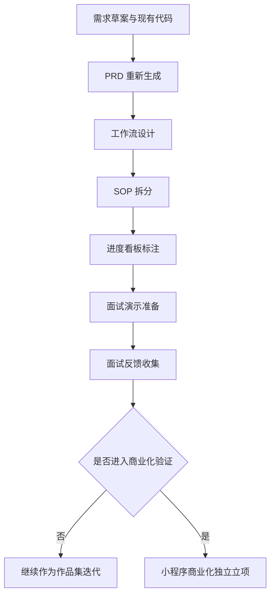
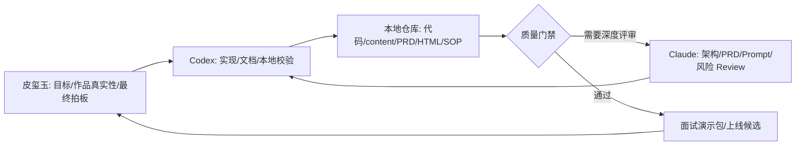
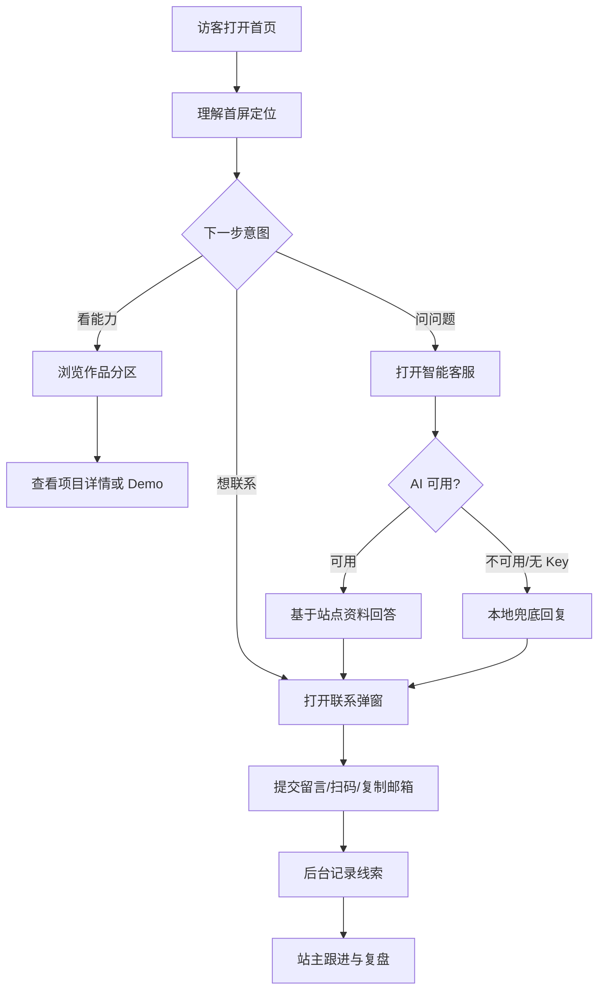
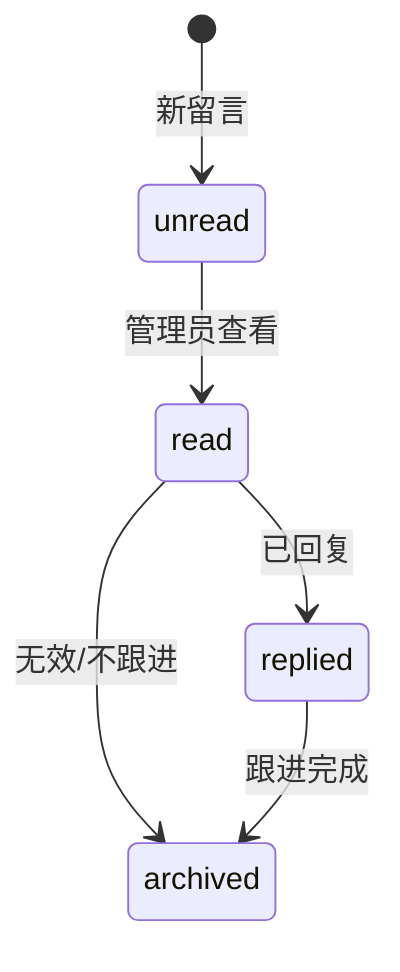

# 皮玺玉个人 IP 站工作流

## 0. 文档定位

| 项目 | 内容 |
| --- | --- |
| 文档版本 | v1.1 |
| 创建日期 | 2026-05-31 |
| 当前阶段 | 面试演示作品集版 |
| 用途 | 说明本项目从需求、开发、评审、内容维护、面试演示到后续商业化立项的完整流程 |
| 本期边界 | 只服务面试演示版；小程序商业化只保留方向，不进入本期执行 |

## 1. 工作流总览

本项目有三条主线：

| 主线 | 解决什么问题 | 当前状态 |
| --- | --- | --- |
| AI 协作开发工作流 | 让 Codex、Claude、Tuzi API 的职责清楚，避免“想到哪做到哪” | 进行中 |
| 产品运行工作流 | 让访客能看作品、问客服、留言，站主能后台复盘 | 已实现基础链路 |
| 面试演示工作流 | 让 10 分钟演示有顺序、有证据、有兜底 | 待跑通 |

## 2. 默认 AI 工作环境

用户未指定其他工具时，默认采用这套环境：

| 工具/平台 | 默认角色 | 在本项目里的具体任务 | 状态 |
| --- | --- | --- | --- |
| Codex | 主实现者 | 读取项目、修改文档、生成 HTML、生成 SOP/进度看板、跑本地校验 | 已使用 |
| Claude | 评审与思考伙伴 | PRD 评审、架构评审、Prompt 评审、风险检查、代码 Review | 待接入 |
| Tuzi API | 运行时模型网关 | 后续统一客服模型路由、摘要、结构化提取、多模型实验 | 待确认 |
| Tuzi pricing page | 模型/价格核验入口 | 核对模型、价格、上下文、工具支持、分组策略 | 未核验 |

### 2.1 重要边界

- 当前站点代码已经支持 DashScope/OpenAI 兼容接口。
- Tuzi API 是后续默认工作流里的运行时网关方案，不代表当前已经接入。
- 模型名、价格、工具支持和可用性都标记为 `待确认`，不在文档里编造。
- 真实 token、费用、ROI 必须来自平台账单或会话统计，不能凭估计写成事实。

## 3. AI 协作开发工作流

### 3.1 阶段门禁

| 阶段 | 输入 | Codex 动作 | Claude 动作 | 人工确认 | 输出 | 进入下一阶段条件 | 状态 |
| --- | --- | --- | --- | --- | --- | --- | --- |
| D0 资料盘点 | 需求草案、旧 PRD、README、content、代码 | 读取文件、提炼事实、识别现状 | 可选：检查遗漏风险 | 确认项目名和面试演示版定位 | 项目事实清单 | 核心定位明确 | 已完成 |
| D1 PRD 重整 | D0 输出、PRD Skill | 生成 PRD Markdown/HTML | 可选：评审结构和范围 | 确认本版边界 | PRD v1.0-v1.1 | 不混入小程序验收 | 已完成 |
| D2 工作流/SOP | 更新后 PRD Skill、用户指令 | 生成工作流、SOP、进度看板 | 可选：评审流程是否可执行 | 确认默认 AI 环境 | PRD v1.3 + 独立文档 | 流程能照着执行 | 进行中 |
| D3 面试演示打磨 | PRD、页面、后台、客服 | 生成演示脚本、测试清单、兜底话术 | 可选：模拟面试追问 | 确认 2 个主讲项目 | 10 分钟演示包 | 全链路能跑通 | 待开始 |
| D4 公开上线加固 | 环境变量、域名、隐私说明、部署平台 | 检查配置、生成上线清单、协助修复 | 可选：安全/隐私评审 | 确认是否公开访问 | 上线候选版本 | 默认密码/Key/隐私风险处理 | 待开始 |
| D5 小程序商业化立项 | 面试反馈、真实咨询、私域数据 | 起草小程序独立 PRD | 可选：商业模型评审 | 确认立项 | 小程序商业化 PRD | 有真实需求和服务模型 | 非本期 |

### 3.2 协作泳道

### 3.3 质量门禁

| 门禁 | 检查内容 | 通过标准 | 不通过处理 |
| --- | --- | --- | --- |
| 需求门禁 | 当前目标是否仍是面试演示版 | 不把小程序商业化写成本期验收 | 回到概念边界重写 |
| 文档门禁 | PRD、HTML、工作流、SOP 是否同步 | 版本号、章节和关键结论一致 | 同步修订记录和文档入口 |
| 数据门禁 | content JSON 是否可读、字段是否匹配 | 页面能正常展示项目/服务/个人信息 | 修 JSON 字段或补默认值 |
| 安全门禁 | Key、后台密码、邮箱授权码是否泄露 | 真实密钥不进前端、不进 Git | 移除密钥，改环境变量 |
| 演示门禁 | 首页、作品、客服、留言、后台是否跑通 | 10 分钟内可完整演示 | 准备截图/录屏/兜底说法 |
| 成本门禁 | 是否写了无法证明的费用或 ROI | 未知值标记待统计/待确认 | 删除编造值，补追踪口径 |

## 4. 产品运行工作流

### 4.1 访客主链路

### 4.2 运行节点

| 节点 | 触发 | 系统输入 | 系统处理 | 输出 | 异常兜底 | 埋点/记录 | 状态 |
| --- | --- | --- | --- | --- | --- | --- | --- |
| 首屏定位 | 访问 `/` | `profile.json`、吉祥物图片 | 渲染 Hero、slogan、CTA | 首屏 | 图片失败不阻断文案 | `page_view` | 已实现 |
| 作品浏览 | 滚动/点击 CTA | `categories.json`、`projects.json` | 按分区和 priority 展示卡片 | 作品区 | 空分类不展示或显示占位 | `button_click` | 已实现 |
| 项目详情 | 点击卡片 | project 对象 | 展示 longDesc、tags、tech、highlights | 详情弹窗 | 缺字段则隐藏对应区块 | 待补项目点击事件 | 已实现 |
| 智能客服 | 打开客服并提问 | 最近 8 条消息、站点知识 JSON | 调用 `/api/chat`，模型回答 | 回复消息 | 无 Key/报错时返回兜底 | `chat_open`、`chat_send` | 已实现 |
| 联系留言 | 提交表单 | name、contact、message | 写入 `contacts.jsonl`，可选邮件提醒 | 成功提示 | API 失败提示用二维码/邮箱 | `contact_open`、`contact_submit` | 已实现 |
| 后台复盘 | 登录 `/admin` | Token、JSONL 数据 | 汇总留言、事件、提醒、安全状态 | 后台看板 | Token 失效重新登录 | 后台不记录自身埋点 | 已实现 |

### 4.3 留言状态流转

## 5. 模型/接口路由

### 5.1 当前路由

| 场景 | 当前优先路径 | 当前兜底路径 | 环境变量 | 风险提示 |
| --- | --- | --- | --- | --- |
| 智能客服问答 | `/api/chat` 调用 DashScope/OpenAI 兼容接口 | 未配置 Key 时返回本地基础回复 | `DASHSCOPE_API_KEY`、`QWEN_API_KEY`、`OPENAI_API_KEY`、`AI_MODEL`、`AI_API_URL` | Key 只能放后端 |
| 内容展示 | `/api/content` 或本地 content 数据 | 静态内容继续展示 | 无 | content JSON 必须合法 |
| 留言保存 | `/api/contact` 写入 JSONL | 提示使用二维码/邮箱 | `CONTACT_NOTIFY_EMAIL` 可选 | 多实例部署需迁移数据库 |
| 邮件提醒 | Resend 或 SMTP | 只保存留言，不提醒 | `RESEND_API_KEY` 或 SMTP 变量 | 授权码不能提交 Git |
| 后台登录 | `/api/admin/login` + Token | 登录失败提示 | `ADMIN_USER`、`ADMIN_PASS`、`ADMIN_SECRET` | 上线必须替换默认值 |

### 5.2 后续 Tuzi API 路由方案（待确认）

| 路由层级 | 用途 | 建议策略 | 待确认项 |
| --- | --- | --- | --- |
| 基础问答模型 | 个人介绍、作品介绍、联系方式 | 低成本、低温度、短回复 | Tuzi 可用模型、价格、上下文长度 |
| 长文本总结模型 | 项目详情总结、PRD 摘要、面试稿压缩 | 更长上下文，控制输出格式 | 模型能力和费用 |
| 结构化提取模型 | 从留言中抽取需求类型、预算、时间 | JSON 输出，失败可重试 | 函数调用/JSON 稳定性 |
| 兜底模型 | 主模型失败时备用 | 返回“暂时不确定，引导留言” | 失败判断规则 |
| 禁用场景 | 报价、敏感隐私、资料外事实 | 不调用模型或强制拒答 | 风控文案 |

### 5.3 Prompt 安全规则

| 规则 | 说明 | 失败后处理 |
| --- | --- | --- |
| 只基于站点资料回答 | 使用 profile、projects、services，不补私密事实 | 回答“不确定”，引导留言 |
| 不自动报价 | 定制服务价格需要人工沟通 | 引导填写需求 |
| 不承诺项目结果 | 不保证 offer、收入、商业结果 | 改成“可以进一步评估” |
| 不收集敏感信息 | 不主动要求身份证、银行卡、详细住址 | 提示只留联系方式和需求概述 |
| 保留模型失败兜底 | 模型超时、无 Key、返回异常不能白屏 | 返回本地兜底文案 |

## 6. 面试演示工作流

| 顺序 | 演示动作 | 讲解重点 | 风险 | 兜底 |
| --- | --- | --- | --- | --- |
| 1 | 打开首页 | 一句话定位：个人 IP + AI 工作流作品集 | 图片加载慢 | 先讲文案和结构 |
| 2 | 展示作品分区 | 按用户问题分区，不按工具类型分区 | 项目太多显散 | 只讲 2 个代表项目 |
| 3 | 打开 Live 项目 | 证明不是纯概念，有真实实现 | Demo 打不开 | 准备截图或本地文件 |
| 4 | 打开智能客服 | 展示 AI 能力和知识边界 | 网络或 Key 不可用 | 展示兜底回复，说明防幻觉设计 |
| 5 | 提交留言 | 展示前台到后台闭环 | API 未启动 | 说明本地需要启动 full dev |
| 6 | 进入后台 | 展示运营意识和数据闭环 | 忘记密码 | 准备演示账号环境变量 |
| 7 | 打开 PRD/SOP | 展示产品文档和流程能力 | 文档太长 | 只讲当前主线、进度、风险 |

## 7. 小程序商业化后续工作流（非本期）

| 阶段 | 触发条件 | 需要新增的工作 |
| --- | --- | --- |
| 需求验证 | 面试或私域中出现稳定付费咨询需求 | 收集真实用户、场景、预算、支付意愿 |
| 商业化 PRD | 至少 3 类明确服务需求出现 | 写小程序独立 PRD |
| 交易闭环 | 服务范围、价格、售后能标准化 | 设计账号、订单、支付、退款、通知 |
| 交付系统 | 有重复交付压力 | 设计模板、资料上传、交付进度、评价 |
| 合规加固 | 准备公开商业化 | 用户协议、隐私政策、支付合规、数据留存 |

